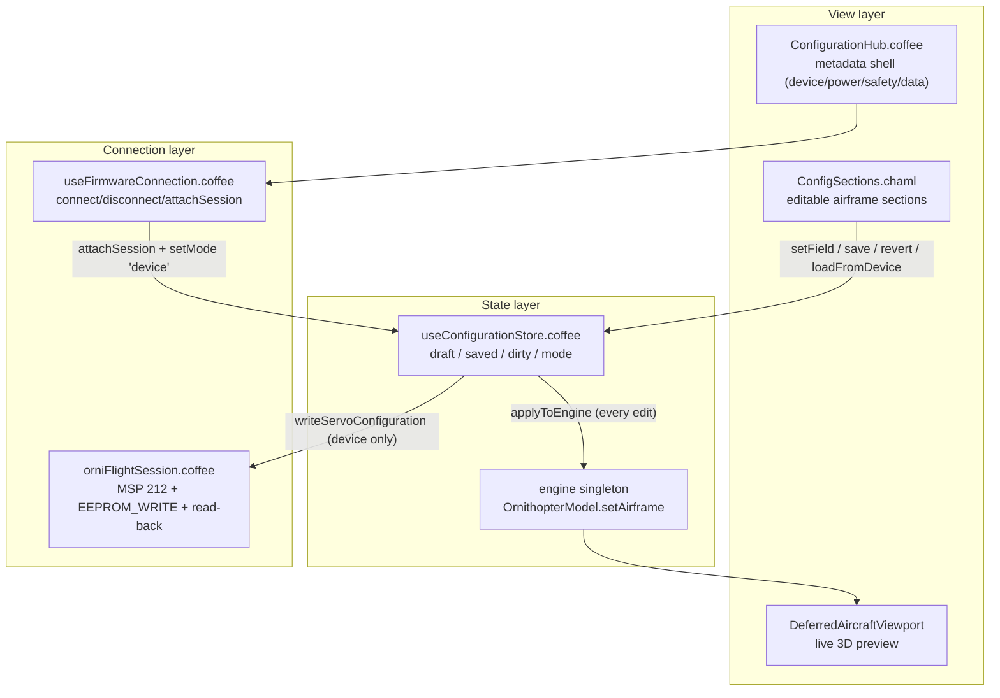

# OrniFlight Studio — Configuration View

This document is the permanent record of the **Configuration View** magnum opus:
the polymorphic airframe-configuration surface that replaces the legacy
configurator. It owns the *draft → commit* lifecycle, mirrors every edit into
the live 3D preview, and — only when a controller is attached — synchronizes
servo configuration through the MSP session.

Companion documents:

- [`CONFIGURATION_MODEL.md`](CONFIGURATION_MODEL.md) — the domain model:
  workspaces, availability states, legacy-tab mapping.
- [`MSP-PROTOCOL.md`](MSP-PROTOCOL.md) — the byte-level MSPv2 layer beneath the
  session boundary described here.
- [`SERVOS-VIEW.md`](SERVOS-VIEW.md) — the dedicated servo & wing-mapping
  surface; the legacy `servos` slice here shares its wire codec.
- [`RECEIVER-MODES.md`](RECEIVER-MODES.md) — the RX & AUX mode-range surface;
  shares the polymorphic draft/saved/mode pattern and source-device pin.

---

## 1. Architecture

The Configuration View is deliberately **layered by responsibility**, not by
feature. A thin metadata shell (the hub) presents *what* can be configured; a
single stateful store owns *how* edits flow; a session boundary owns *where*
they persist.



### Three responsibilities, three files

| File | Role | Statefulness |
|---|---|---|
| `src/components/views/ConfigurationHub/ConfigurationHub.coffee` | Metadata shell: workspace cards, availability labels, device summary | Stateless (reads stores) |
| `src/stores/useConfigurationStore.coffee` | The single source of truth for the configuration document | Zustand store |
| `src/hooks/useFirmwareConnection.coffee` | MSP connection lifecycle and the bridge into the store | Module-level `_session`/`_client` |

---

## 2. The polymorphic store

`useConfigurationStore` is a Zustand store implementing a **configuration
document** with three copies of the same shape plus a mode flag:

| Field | Meaning |
|---|---|
| `draft` | The working copy. Every `setField` mutates it and sets `dirty: true`. |
| `saved` | The last committed document. `revert()` copies it back into `draft`. |
| `dirty` | `true` when `draft ≠ saved`. Drives the DIRTY badge and Revert enablement. |
| `mode` | `'sim'` (default) or `'device'`. Never assumed — the UI always reads it. |
| `session` | The attached `OrniFlightSession`, or `null` when offline. |

The document shape is normalized on **every write** by `normalizeDraft`, so
`draft` is always well-formed regardless of input:

```
draft
├── pairCount        # clamped to 1..4
├── geometry         # { wingSpan, chord, wingArea, aspectRatio } — derived
├── mass             # { totalMass, cgX, cgZ }
├── servos           # device-read servo configurations (MSP 120)
└── servoMounts      # [{ index, x, z, angle }] — one per pair
```

`geometry.wingArea` and `geometry.aspectRatio` are **derived**, not stored:
`normalizeGeometry` recomputes them from `wingSpan` and `chord` via
`deriveGeometry`. Editing `wingSpan` or `chord` therefore keeps the derived
fields consistent without any second write.

### API reference

| Method | Signature | Behavior |
|---|---|---|
| `setField(path, value)` | `('geometry.wingSpan', 1500)` | Deep-set a dotted path, re-normalize, mirror to engine, `dirty: true`. No-op on forbidden/malformed paths. |
| `save(servoConfigs?)` | `()` or `([…])` | Commit. Sim: local only. Device: writes each servo config through the session, then commits. Returns the saved doc. |
| `revert()` | `()` | Copy `saved` back into `draft`, `dirty: false`. |
| `setMode(mode)` | `('sim' | 'device')` | Throws on unknown mode. |
| `attachSession(session)` | `(sess | null)` | Bind/unbind the MSP session. |
| `loadFromDevice(session?)` | `(sess?)` | Read servo configurations over MSP, set mode `device`, clear dirty. |
| `reset()` | `()` | Restore `AIRFRAME_DEFAULTS`, sim mode, no session. |

`AIRFRAME_DEFAULTS` is exported and `Object.freeze`-d; the store clones it on
creation so the frozen template is never mutated by accident.

---

## 3. Mode semantics — sim vs device

The store is **never allowed to assume a device is present**. Two modes gate
every side effect:

**`sim` (default)** — a dry-run. `save()` commits the draft locally and mirrors
it into the engine; no MSP traffic is generated. The UI renders a `SIMULATION`
badge. This is the only mode available with the built-in simulation transport.

**`device`** — entered by `useFirmwareConnection` after a successful
`handshake()` (`attachSession(session)` + `setMode('device')`). `save()` then
writes each servo configuration through `session.writeServoConfiguration`,
which performs a **SET → EEPROM_WRITE → read-back** roundtrip per servo.

The guard is hard, not advisory: `save()` and `loadFromDevice()` **throw** when
in `device` mode without a session. There is no silent degradation path that
could write into the void.

```coffee
save: (servoConfigs = null) ->
  { mode, session, draft } = get()
  if mode == 'device'
    throw new Error 'No device session attached' unless session?
    # ... write each config, then commit
  # sim path: commit locally
```

---

## 4. Live preview via engine mirroring

Every successful `setField` calls `applyToEngine(draft)`, which forwards
`geometry`, `mass`, `pairCount` and `servoMounts` to the `engine` singleton
(`engine.setAirframe`). The 3D viewport subscribes to that engine, so the
preview follows keystrokes **immediately** — no roundtrip through React state
or the network.

The mirror is O(small): `setAirframe` is pure arithmetic (`deriveGeometry`)
plus at most four mounts. Validatio measured the hot path at **0.025 ms per
`setField`** — well inside the ~100 ms keystroke budget, so no debounce is
required.

---

## 5. MSP synchronization path

Geometry, mass, CG and mount positions are **local model state** — OrniFlight
exposes no MSP codes for them, so they live and persist only in the store
(and, in a future milestone, in a portable profile). What *does* sync over
MSP is the servo configuration, which is the controller-owned subset:

| Operation | MSP codes | Guard |
|---|---|---|
| Read servos | `SERVO_CONFIGURATIONS` (optional) | `readServoConfigurations` |
| Write servo `i` | `SET_SERVO_CONFIGURATION` → `EEPROM_WRITE` → read-back | `writeServoConfiguration` |
| Craft name | `SET_NAME` → `EEPROM_WRITE` → `NAME` read-back | `setCraftName` |

The session enforces the device boundary at every write:

- **armed-guard** — no writes while `lastStatus.armed` (throws).
- **index-range** — `0 <= index < MAX_SERVO_CONFIGS` (throws).
- **name-length** — craft name must be 1–24 characters (throws).
- **read-back verification** — after every EEPROM write the value is re-read
  and compared; mismatch throws instead of silently persisting a wrong value.

`useFirmwareConnection` is the only entry point that crosses this boundary; it
exposes `connect`, `disconnect`, `setCraftName`, `readServoConfigurations` and
`writeServoConfiguration` to the view layer, and keeps the module-level
`_session`/`_client` so `cleanup()` can detach the store (`attachSession null`,
`setMode 'sim'`) deterministically on disconnect.

---

## 6. Security invariants

Validatio closed a **prototype-pollution** hole in `setField` and hardened the
input path. These are invariants — do not regress them:

### Forbidden-segment blocklist

A naive deep-set like `node[part]` descends through truthy segments, so
`setField('__proto__.polluted', v)` resolves `node['__proto__']` to
`Object.prototype` and writes globally. The store now blocks the magic
segments before traversal:

```coffee
FORBIDDEN_SEGMENTS = new Set ['__proto__', 'constructor', 'prototype']
validPath = (parts) ->
  parts.length and parts.every (part) ->
    part isnt '' and not FORBIDDEN_SEGMENTS.has(part)
```

`validPath` validates **every** segment including the leaf. Regression tests
assert `Object.prototype`/`Array.prototype` stay clean after four attack
vectors (`__proto__.polluted`, `constructor.prototype.polluted`,
`servos.__proto__.pollutedArr`, `geometry.__proto__.sub`).

### Primitive-descent guard

`isObjectLike` stops the descent at primitive leaves, which both prevents a
Strict-mode `TypeError` (`mass.totalMass.sub`) and keeps the draft invariant —
a malformed path is a no-op, not a crash, and `dirty` stays `false`.

### Sanitization of numeric fields

`finiteOr(fallback, value)` collapses non-finite input (`NaN`, `±Infinity`,
`null`, `undefined`) to the fallback while preserving finite `0`:

- `clampInt` → `finiteOr` for `pairCount` (range 1–4).
- `normalizeMass` → `finiteOr` for `totalMass` (default 520), `cgX`, `cgZ`.
- `normalizeMounts` → `finiteOr` for `x`, `z`, `angle`.

### No XSS surface

The view layer uses no `dangerouslySetInnerHTML`, `innerHTML`, `eval`, or
`new Function`; React escapes by default. `JSON.parse` appears only in the
store's internal `clone` (own data) and in the telemetry worker frame parse
(validated, try/catch; postMessage structured-clone is pollution-immune).

---

## 7. Extending the view

To add a **field**: add a `%ParamRow` in `ConfigSections.chaml` (airframe) or a
group in `ConfigurationHub.coffee`'s `HUBS` map (workspace metadata). If the
field is airframe geometry/mass/mount state, add its normalization to
`normalizeDraft` (so `draft` stays well-formed) and a `finiteOr` guard for any
numeric input.

To add **MSP sync** for a new parameter: the contract lives in
`orniFlightSession.coffee` — add a read/write method with the same armed-guard,
range-check, and read-back discipline, then expose it in
`useFirmwareConnection` and route it through `useConfigurationStore`.

The rule that keeps the architecture coherent: **the view never talks to the
session directly**, and **the store never assumes a device**. Every wire that
crosses the device boundary passes through `useFirmwareConnection`.

---

## 8. Testing coverage

| Suite | Cases | What it pins |
|---|---|---|
| `useConfigurationStore.test.coffee` | 22 | draft/commit/revert lifecycle, sim/device modes, engine mirroring, sanitization, prototype-pollution regression, primitive-descent no-op |
| `ConfigSections.test.coffee` | 9 | render of sections, SIMULATION badge, DIRTY flag, field edit → dirty, save → clear |
| `useFirmwareConnection.test.coffee` | 2 | connection lifecycle integration |

Full run: `npx vitest run` (242 tests / 22 suites, green). The store tests are
the contract tests — if you change `setField`, `save`, or the normalization
pipeline, run them first.

---

## 9. Troubleshooting

**"No device session attached" when saving.** The store is in `device` mode but
no session is bound. In normal flow `useFirmwareConnection.connect` attaches the
session after a successful `handshake()`. If you see this, the connection was
never established or was torn down — check `useDeviceStore.lastError` and the
`CONNECTION_FAILED` state-machine event.

**Edits don't appear in the 3D preview.** The mirror runs on every `setField`,
so this usually means the viewport is reading a stale engine reference. Confirm
the edit actually mutated the draft (`dirty` badge) — a blocked path (forbidden
segment or primitive descent) is a silent no-op by design.

**Field snaps back to a default on blur.** A non-finite or out-of-range value
hit a `finiteOr`/`clampInt` guard during normalization. This is intentional
sanitization, not data loss — the raw value never reaches the document.

**"Cannot write configuration while armed."** The session's armed-guard fired.
Disarm the controller before writing configuration; the Device summary also
disables the craft-name form while `status.armed`.