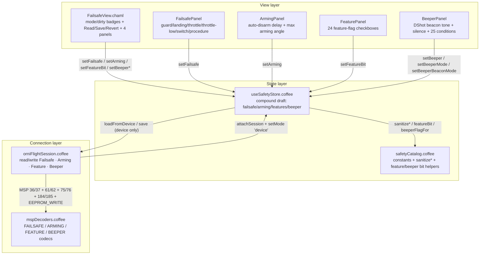

# OrniFlight Studio — Failsafe & Arming

This document is the permanent record of the **Failsafe & Arming** magnum opus:
the polymorphic safety-configuration surface of an ornithopter. It owns the
*draft → commit* lifecycle across **four independent flat wire documents** — the
failsafe document (`FAILSAFE_CONFIG` / `SET_FAILSAFE_CONFIG`), the arming
document (`ARMING_CONFIG` / `SET_ARMING_CONFIG`), the feature-flag document
(`FEATURE_CONFIG` / `SET_FEATURE_CONFIG`), and the beeper document
(`BEEPER_CONFIG` / `SET_BEEPER_CONFIG`) — clamps every edit through a pure
catalog, and — only when a controller is attached — synchronizes through the MSP
session with a SET + EEPROM_WRITE + read-back verification per document.

The failsafe surface is **ornithopter-first**: the DROP procedure folds the wings
into the glide fallback, AUTO-LAND holds level flight while the motor settles,
and throttle `1000 µs` is the motor-off floor. Unlike a quadrotor, a flapping
wing never free-falls — it glides — so the copy and the defaults both foreground
that glide path over a raw motor-cut.

Companion documents:

- [`MSP-PROTOCOL.md`](MSP-PROTOCOL.md) — the byte-level MSPv2 layer beneath the
  session boundary described here.
- [`RECEIVER-MODES.md`](RECEIVER-MODES.md) and
  [`PID-TUNING-VIEW.md`](PID-TUNING-VIEW.md) — the sibling polymorphic stores;
  the draft/saved/mode pattern, the source-device pin, and the security
  invariants are shared.
- [`SERVOS-VIEW.md`](SERVOS-VIEW.md) — the servo & wing-mapping surface; shares
  the draft/saved/mode pattern and the armed-guard write discipline.
- [`VTX-PORTS.md`](VTX-PORTS.md) — the VTX & serial-port surface; the fourth
  sibling polymorphic store in the same twin-domain family.

---

## 1. Architecture

The Failsafe & Arming surface is **layered by responsibility**. One thin CHAML
shell presents *what* can be configured (four panels under a single route); one
stateful store owns *how* edits flow and clamp; one pure catalog owns *what is
legal* (procedures, switch modes, feature bits, beeper modes); a session boundary
owns *where* they persist. All four sub-documents are independent — the firmware
performs no arbitration between them, so neither does the studio.



### Responsibilities, file by file

| File | Role | Statefulness |
|---|---|---|
| `src/components/views/FailsafeView/FailsafeView.chaml` | Mode/dirty badges, error alert, action bar, hosts the four panels | Stateless (reads the store) |
| `src/components/panels/FailsafePanel/FailsafePanel.chaml` | Guard time, landing time, throttle, throttle-low delay, switch mode, procedure | Stateless (reads the store) |
| `src/components/panels/ArmingPanel/ArmingPanel.chaml` | Auto-disarm delay, max arming angle | Stateless (reads the store) |
| `src/components/panels/FeaturePanel/FeaturePanel.chaml` | 24 feature-flag checkboxes | Stateless (reads the store) |
| `src/components/panels/BeeperPanel/BeeperPanel.chaml` | DShot beacon tone, beacon silence, 25 beeper conditions | Stateless (reads the store) |
| `src/stores/useSafetyStore.coffee` | Single source of truth for all four sub-documents | Zustand store |
| `src/lib/safetyCatalog.coffee` | Static constants, sanitizers, feature/beeper bit helpers | Pure module |
| `src/protocol/mspDecoders.coffee` / `orniFlightSession.coffee` | Wire codec + session read/write boundary | MSP layer |

`FailsafeView` is mounted at the `/safety` route in `src/app/App.chaml`
(`import` at line 24, `safetyEl = h(AnimatedPage, null, h(FailsafeView, null))`
at line 46, route at line 67). It is reached via the **Safety** tab in
`ConfigTabs.chaml` (line 16, `data-glyph: '🛡'`). The four panels are co-located
under `src/components/panels/` and render only studio-side catalog constants —
never firmware-derived strings.

---

## 2. Wire format ground truth

Ground truth is the OrniFlight firmware source
(`src/main/flight/failsafe.c/.h`, `fc/rc_controls.c`, `flight/imu.c`,
`config/feature.h`, `io/beeper.h`, `pg/beeper.c`). Eight MSP codes are involved:

| Purpose | Read | Write |
|---|---|---|
| Feature flags (absolute u32 mask) | `FEATURE_CONFIG` = 36 | `SET_FEATURE_CONFIG` = 37 |
| Arming (auto-disarm, small angle) | `ARMING_CONFIG` = 61 | `SET_ARMING_CONFIG` = 62 |
| Failsafe (behavior after link loss) | `FAILSAFE_CONFIG` = 75 | `SET_FAILSAFE_CONFIG` = 76 |
| Beeper (off-mask, DShot beacon) | `BEEPER_CONFIG` = 184 | `SET_BEEPER_CONFIG` = 185 |

### Failsafe — 8 fixed bytes (`failsafeConfig_t`)

| Offset | Field | Width | Unit | Notes |
|---|---|---|---|---|
| 0 | `delay` | u8 | × 0.1 s | Guard time before the failsafe fires |
| 1 | `offDelay` | u8 | × 0.1 s | Landing/glide time after the failsafe fires |
| 2 | `throttle` | u16 | µs | 1000–2000; 1000 = motor off |
| 4 | `switchMode` | u8 | enum | 0 stage1, 1 kill, 2 stage2 |
| 5 | `throttleLowDelay` | u16 | ms | Throttle-low wait |
| 7 | `procedure` | u8 | enum | 0 AUTO-LAND, 1 DROP, 2 GPS-RESCUE |

### Arming — 3 fixed bytes (`armingConfig_t`)

| Offset | Field | Width | Unit | Notes |
|---|---|---|---|---|
| 0 | `autoDisarmDelay` | u8 | s | 0 = disabled |
| 1 | reserved | u8 | — | Always 0 on the wire |
| 2 | `smallAngle` | u8 | ° | 0–180; 180 = always arm |

`SET_ARMING_CONFIG` consumes `smallAngle` only when a third byte arrives, so the
codec always emits all three bytes. `gyro_cal_on_first_arm` is presentational —
it rides the firmware default (0, off) and is **not** part of the wire record.

### Features — 4 fixed bytes (absolute u32 mask)

`MSP 36` returns `getFeatureMask()` as a little-endian u32. `SET_FEATURE_CONFIG`
only *stages* the value; the subsequent `EEPROM_WRITE` *materializes* it via
`writeEEPROMWithFeatures`. The mask rides the wire absolute — unsupported bits are
never fabricated.

### Beeper — 9 fixed bytes (`beeperConfig_t`)

| Offset | Field | Width | Notes |
|---|---|---|---|
| 0 | `offFlags` | u32 | Bits 0..23 mute modes 1..24; bit 24 = the ALL sentinel |
| 4 | `dshotBeaconTone` | u8 | 0–255 |
| 5 | `dshotBeaconOffFlags` | u32 | Masked against `RX_LOST \| RX_SET` |

`SET_BEEPER_CONFIG` tolerates 4/5/9-byte payloads on the firmware side (trailing
fields optional); the codec always emits the full 9-byte record.

### Firmware defaults (`pgResetTemplate`)

| Document | Default |
|---|---|
| Failsafe | `delay 4`, `offDelay 10`, `throttle 1000`, `switchMode 0`, `throttleLowDelay 100`, `procedure 1` (DROP) |
| Arming | `autoDisarmDelay 5`, `smallAngle 25` |
| Features | `DEFAULT_FEATURES 0 \| DEFAULT_RX_FEATURE RX_PARALLEL_PWM` → `1 << 13` (8192) |
| Beeper | `offFlags 0`, `dshotBeaconTone 1`, `dshotBeaconOffFlags` = `RX_LOST \| RX_SET` (514) |

---

## 3. The pure catalog — `safetyCatalog.coffee`

A zero-class, zero-side-effect module that mirrors the firmware wire formats
exactly. Everything exported is either a frozen constant, a sanitizer, or a pure
bit helper.

### Constants

| Export | Value | Meaning |
|---|---|---|
| `FAILSAFE_THROTTLE_MIN` / `MAX` | 1000 / 2000 | Throttle clamp window |
| `FAILSAFE_PROCEDURES` | AUTO-LAND=0, DROP=1, GPS-RESCUE=2 | Wire order is the id |
| `FAILSAFE_SWITCH_MODES` | STAGE 1=0, KILL=1, STAGE 2=2 | From the `failsafe_switch_mode` comment |
| `ARMING_SMALL_ANGLE_MAX` | 180 | 180 = always arm |
| `FEATURE_BITS` | 24 entries | `bit` = `1 << wireBit` per `features_e` |
| `FEATURE_SUPPORTED_MASK` | computed | OR of all supported bits — hostile bits masked off |
| `DEFAULT_FEATURE_MASK` | `1 << 13` | `RX_PARALLEL_PWM` |
| `BEEPER_MODES` | 24 entries (id 1..24) | `beeperMode_e` order preserved |
| `BEEPER_ALL` / `BEEPER_ALL_FLAG` | id 25 / `1 << 24` | Silence-all sentinel |
| `BEEPER_OFF_FLAGS_MASK` | `(1 << 25) - 1` | offFlags bits 0..24 |
| `DSHOT_BEACON_ALLOWED_FLAGS` | `(1 << 1) \| (1 << 9)` | `RX_LOST \| RX_SET` |
| `DSHOT_BEACON_MODES` | RX_LOST, RX_SET | The two modes the beacon honours |

### Sanitizers

`sanitizeFailsafe`, `sanitizeArming`, `sanitizeFeatures`, `sanitizeBeeper` each
build a **fresh object literal from a fixed key list** — an attacker key
(`__proto__`, `constructor`) dies in the merge because it is never read back out.
`clampU8`/`clampU16`/`clampU32` NaN-guard via `Number.isFinite` (or truncation
for the u32); `clampInt` rounds and falls back to `lo` on non-finite input.

### Bit helpers

`featureBit`, `featureIsSet`, `featureSetBit`, `featureClearBit`,
`beeperFlagFor` (`1 << (mode - 1)`), and `beeperModeSilenced` (a set off-mask
flag silences its condition — the wire stores the inverse of the UI's "enabled").

---

## 4. The polymorphic store — `useSafetyStore.coffee`

A Zustand store whose `draft` is a **compound of four wire-true sub-documents**,
so no impedance exists between store and MSP. State shape:

```
{ mode: 'sim' | 'device', session, loadedSession,
  draft: { failsafe, arming, features, beeper },
  saved, dirty, lastError }
```

### Mutation API

| Action | Semantics |
|---|---|
| `setFailsafe(patch)` | Merge + `sanitizeFailsafe`; no-op if unchanged |
| `setArming(patch)` | Merge + `sanitizeArming`; no-op if unchanged |
| `setFeatures(mask)` | `sanitizeFeatures` (clamp + supported-mask AND) |
| `setFeatureBit(bit, enabled)` | Set/clear one bit, then `setFeatures` |
| `setBeeper(patch)` | Merge + `sanitizeBeeper`; no-op if unchanged |
| `setBeeperMode(mode, enabled)` | Toggle one off-mask flag (inverse semantics) |
| `setBeeperBeaconMode(mode, enabled)` | Toggle one DShot beacon off-flag |

Every setter marks `dirty: true` only on an actual change (JSON-string compare
guards the no-op path).

### Polymorphism

| Path | `sim` | `device` |
|---|---|---|
| `attachSession(session)` | `session = null` → `mode: 'sim'` | `session` → `mode: 'device'` |
| `loadFromDevice(session)` | — | `read*Config` × 4, pins `loadedSession`, sets `saved` |
| `save()` | commits `draft` locally (dry-run) | refuses without `loadedSession == session`, then `write*Config` × 4 |
| `reset()` | resets to `draftDefaults` | clears session + `loadedSession` |

`loadedSession` is the **source-device pin**: values read from one craft can
never be written to a different one. `save` on device requires a prior
`loadFromDevice`; both `save` and `loadFromDevice` record `lastError` and rethrow
on guard failure, so the view's error alert surfaces the exact message.

---

## 5. Session boundary — `orniFlightSession.coffee`

Eight methods, four read/write pairs:

| Read | Write |
|---|---|
| `readFailsafeConfig()` | `writeFailsafeConfig(config)` |
| `readArmingConfig()` | `writeArmingConfig(config)` |
| `readFeatureConfig()` | `writeFeatureConfig(mask)` |
| `readBeeperConfig()` | `writeBeeperConfig(config)` |

Each read uses `requestOptional` and returns `null` when the firmware withholds
the document. Each write follows one discipline:

```
armed guard → SET_* → EEPROM_WRITE → read-back → matcher → return readBack
```

- **Armed guard**: `throw 'Cannot write configuration while armed'` if
  `@lastStatus?.armed` — all four writes lock while armed.
- **EEPROM_WRITE**: the persistence materializer; for features it is the *only*
  thing that commits the staged mask.
- **Read-back matchers**: `failsafeConfigMatches` / `armingConfigMatches` /
  `beeperConfigMatches` compare field-wise, falling back to the firmware default
  for any field the caller omitted. `writeFeatureConfig` compares the u32
  directly (`readBack == (mask >>> 0)`).

A mismatch after write throws a domain-specific error (e.g.
`Failsafe configuration read-back mismatch`), never silently accepts a partial
commit.

---

## 6. Security invariants (Validatio)

Five axes audited at commit `f11dbe6` — zero vulnerabilities found:

1. **XSS — zero sinks.** No `dangerouslySetInnerHTML` / `innerHTML` / `eval` /
   `new Function` in the safety domain. Panels render only studio-side catalog
   constants (feature labels, beeper labels, procedure names) as React text
   nodes — no firmware-derived string ever reaches the DOM unsanitized.
2. **Prototype pollution — closed.** Every setter merges a patch then sanitizes,
   and every sanitizer builds a fresh object literal from a fixed key list.
   `__proto__` / `constructor` keys die in the merge. `sanitizeFeatures` =
   `clampU32(mask) & FEATURE_SUPPORTED_MASK`.
3. **Codec bounds — zero over-read.** `ByteReader.remaining()` guards every field
   with a `DEFAULT_*` fallback; `skip()` clamps; `DataView` respects
   `byteOffset`/`byteLength` (subarray-safe). All four decoders are truncation-
   tolerant.
4. **Session guards — double-locked.** Armed-write lock on all four write paths;
   `loadedSession` pin in `save` (foreign-session refusal); read-back matchers
   field-wise with defaults; `attachSession(null)` → `sim`.
5. **Integrity.** Raw-byte scan confirmed zero HTML-entity corruption across all
   `.coffee`/`.chaml`/`.sass` files (the guard-fix `loadFromDevice` session check
   moved inside the `try` so `lastError` is set before rethrow).

---

## 7. Performance profile

- **Codec hot path**: 537,215 ops/s (400k round-trips in 745 ms). A save is four
  documents ≈ 7 µs of wire encoding — negligible.
- **Render amplification**: the view and all four panels subscribe to the whole
  store, so one mutation re-renders the whole tree. Accepted as within budget —
  each panel is a flat, light form (~20 vnodes); the PID domain only needed
  memoization because it renders 29 heavy `ParamRow` sliders. The permanent
  regression guard is `safetyPerf.test.coffee`.
- **Full suite**: 627/627 tests green across 50 files (~108 s).
- **Build**: clean in ~21 s; the pre-existing 500 KB chunk warning is unrelated
  to the safety domain (~33 KB source, minimal gzip impact).

---

## 8. Testing

54 safety-domain tests across five files:

| File | Count | Coverage |
|---|---|---|
| `src/test/safetyCodec.test.coffee` | 11 | Wire round-trips + edge cases (failsafe 8 B, arming 3 B with `smallAngle` on byte 3, beeper 9 B read-tolerant, feature absolute u32) |
| `src/test/useSafetyStore.test.coffee` | 14 | sim/device polymorphism, `loadedSession` pin, armed-write refusal, defaults for omitted docs |
| `src/test/safetyEdgeCases.test.coffee` | 22 | Sanitizer boundaries, codec wire-width clamps, store error scenarios, session write guards |
| `src/test/safetyPerf.test.coffee` | 2 | Codec hot path + render amplification (regression guard) |
| `src/test/FailsafeView.test.coffee` | 5 | Four panels render with sim badge + defaults; inputs patch the draft; save commits locally |

Run the safety domain in isolation, then the full suite:

```bash
PATH="$HOME/.nvm/versions/node/v22.17.1/bin:$PATH"
npx vitest run src/test/safetyCodec.test.coffee src/test/useSafetyStore.test.coffee \
  src/test/safetyEdgeCases.test.coffee src/test/safetyPerf.test.coffee \
  src/test/FailsafeView.test.coffee
npx vitest run          # full suite — 627/627 green
```

---

## 9. Troubleshooting

| Surface | Message | Cause → fix |
|---|---|---|
| Error alert | `Cannot write configuration while armed` | A write hit the armed-guard → disarm, then save |
| Error alert | `Read device safety configuration before saving` | `loadedSession != session` → read from the attached device first |
| Error alert | `No device session attached` | `save`/`loadFromDevice` in `device` mode with no session → connect/attach |
| Error alert | `* configuration read-back mismatch` | Firmware tailored the value on write → inspect the actual `readBack` |
| Silent test failure | `??=` syntax error under `npx vitest` | Old Node (v14) resolved first → prefix with the v22.17.1 `PATH` (see README) |

---

## 10. Integration notes

- **Route & tab**: `/safety` route in `App.chaml`; **Safety** tab in
  `ConfigTabs.chaml` (glyph `🛡`).
- **Session attachment**: the connection hook (`useFirmwareConnection`) hands the
  live `orniFlightSession` to the store via `attachSession`; a disconnect hands
  `null`, which drops the store back to `sim` mode.
- **Ornithopter framing**: DROP = glide fallback, AUTO-LAND = level hold while
  the motor settles, throttle 1000 µs = motor off; `MOTOR_STOP` keeps the drive
  off until throttle for glide-first airframes.
- **Layering contract**: codecs clamp to wire width only; semantic clamps
  (throttle window, enums, feature/beeper masks) live in the catalog sanitizers;
  the store sanitizes on mutation.
