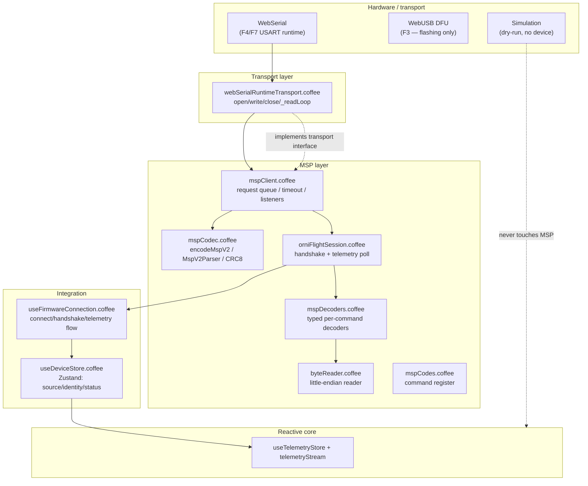

# MSP Protocol Layer — OrniFlight Studio

This document is the permanent record of the MultiWii Serial Protocol (MSPv2)
runtime compatibility layer. It describes the wire format, every module's
contract, the polymorphic transport boundary, and the integration path from a
physical flight controller to the reactive telemetry store.

> **MSP** is the binary request/response protocol spoken by OrniFlight firmware
> on its USART. The layer below is *firmware-agnostic at the byte level*: it
> encodes, decodes, and validates MSPv2 frames, and hands typed payloads up to
> the session. No hardware assumption lives inside the protocol — hardware
> enters only through an injected transport.

---

## 1. Layered architecture



The dependency direction is strict: `Transport → Codec ← Client → Session →
Integration`. The reactive core only ever *reads* the telemetry object; it never
knows MSP exists.

---

## 2. MSPv2 wire format

Every frame is a single `Uint8Array`:

| Offset | Size | Field        | Meaning                                   |
|-------:|-----:|--------------|-------------------------------------------|
| 0      | 1    | `$` (0x24)   | frame start magic                         |
| 1      | 1    | `X` (0x58)   | MSPv2 marker (distinguishes v1/v2)        |
| 2      | 1    | direction    | `<` request, `>` response, `!` unsupported|
| 3      | 1    | flags        | reserved bitfield                         |
| 4–5    | 2    | command      | little-endian 16-bit command id           |
| 6–7    | 2    | payload len  | little-endian 16-bit payload byte count   |
| 8…     | N    | payload      | command-specific bytes                    |
| 8+N    | 1    | CRC          | CRC-8 DVB-S2 over offset 3 → payload end  |

Constants (`mspCodec.coffee`): `HEADER_SIZE = 8`, `FRAME_OVERHEAD = 9`,
`MAX_PAYLOAD = 0xffff`.

### CRC-8 DVB-S2

```
crc8DvbS2(crc, byte):
  crc ^= byte
  repeat 8 times:
    crc = (crc & 0x80) ? ((crc << 1) ^ 0xD5) & 0xFF : (crc << 1) & 0xFF
```

The CRC is seeded at `0` and swept over `[flags, cmdLo, cmdHi, lenLo, lenHi]`
(offset 3 → 7 inclusive) followed by every payload byte. The trailing CRC byte
is **not** included in the sweep.

### Direction semantics

| Char | Meaning                                        | Client reaction |
|------|------------------------------------------------|-----------------|
| `<`  | request (host → FC)                            | encode only     |
| `>`  | response (FC → host)                           | resolve pending |
| `!`  | command not supported by this target           | reject pending  |

---

## 3. Module reference

### 3.1 `src/protocol/byteReader.coffee`

A bounds-checked little-endian cursor over a payload `Uint8Array`. Built on
`DataView` with `true` (little-endian) on every multi-byte read.

| Method                 | Returns            | Over-read behaviour |
|------------------------|--------------------|---------------------|
| `remaining()`          | `int`              | —                   |
| `u8()` / `i8()`        | number             | throws `RangeError` |
| `u16()` / `i16()`      | number (LE)        | throws `RangeError` |
| `u32()`                | number (LE)        | throws `RangeError` |
| `take(count)`          | `Uint8Array`       | throws `RangeError` |
| `ascii(count)`         | string             | via `take`          |
| `lengthPrefixedAscii()`| string             | length byte + ascii |

The invariant is *never return a truncated value*: every read calls `require`
first and raises `"MSP payload truncated: need N, have M"` on short input. This
is what makes the decoders safe against malformed frames.

### 3.2 `src/protocol/mspCodec.coffee`

Pure functions plus one stateful parser. No I/O, no `this` outside the parser.

**Exports**

- `encodeMspV2(command, payload = [], direction = '<', flags = 0)` — validates
  command fits 16 bits, payload ≤ `0xffff`, direction ∈ `{<, >, !}`; returns a
  complete framed `Uint8Array`.
- `asBytes(value)` — normalizes `Uint8Array` / `ArrayBuffer` / array / iterable.
- `crc8DvbS2(crc, byte)` — the CRC step function (see §2).
- `class MspCrcError` — thrown frame for a payload whose CRC mismatches.
- `class MspV2Parser` — streaming reassembler, below.

**Parser (`MspV2Parser`)**

`push(chunk)` accepts arbitrary byte fragments (UART reads are not frame-aligned)
and returns an array of `{ command, direction, flags, payload }` or
`{ error, command, direction }`. Properties:

- **Buffering** — incomplete frames are retained and completed on the next
  `push`; a trailing `$X` pair is kept for the next chunk.
- **Re-sync** — garbage bytes before a `$X` header are skipped; an invalid
  direction byte advances by one and re-scans.
- **Multi-frame** — a single chunk may yield many frames.
- **Linear** — one left-to-right pass; `pos` only advances (no re-scan of the
  whole buffer after each slice). This keeps the hot path O(n) and immune to a
  `$`-spam denial-of-service that the naive slice-and-rescan would trigger
  (O(n²)).
- `reset()` clears the retention buffer (called on `close`).

### 3.3 `src/protocol/mspCodes.coffee`

A frozen-in-practice `MSP_CODES` map (command id → symbol). Deliberately small:
a domain imports a command here only when it gains a typed codec, not the whole
legacy configurator surface. Currently registered: `API_VERSION 1`,
`FC_VARIANT 2`, `FC_VERSION 3`, `BOARD_INFO 4`, `BUILD_INFO 5`, `NAME 10`,
`SET_NAME 11`, `RX_MAP 64`, `STATUS 101`, `RAW_IMU 102`, `SERVO 103`, `RC 105`,
`ATTITUDE 108`, `ANALOG 110`, `SERVO_CONFIGURATIONS 120`, `BATTERY_STATE 130`,
`STATUS_EX 150`, `UID 160`, `SET_SERVO_CONFIGURATION 212`, `EEPROM_WRITE 250`.

### 3.4 `src/protocol/mspClient.coffee`

Request/response client over an injected transport.

**Constructor** `new MspClient(transport, { timeoutMs = 1000 })`.

**Errors** (all exported)

- `MspTimeoutError` — no response within `timeoutMs`.
- `MspUnsupportedError` — target replied with direction `!`.
- `MspDisconnectedError` — transport dropped, or a call was made while closed.

**Transport contract** (the polymorphic boundary)

```coffee
open:          -> Promise        # acquire the channel, idempotent
close:         -> Promise        # release the channel
write: (bytes) -> Promise|void   # send an encoded frame
onData: (handler) ->             # handler(Uint8Array chunk)
onDisconnect: (handler) ->       # handler(Error)
```

`MspClient` only ever calls these six methods. `MockMspTransport` in the tests
proves the injection: the entire MSP layer runs without any WebSerial global.

**Behaviour**

- `open()` — registers `onData`/`onDisconnect`, opens the transport, marks
  opened. **Idempotent and single-flight**: concurrent `open()` calls share one
  in-flight promise (memoized in `@opening`), so a double-connect cannot register
  the listeners twice.
- `request(command, payload, options)` — chains onto an internal promise queue,
  so requests are serialized and never interleave on the wire. Returns the
  response **payload** (already decoded off the frame).
- `requestOptional(...)` — same, but a `MspUnsupportedError` resolves to `null`
  instead of throwing; any other error rethrows.
- `_receive(bytes)` — pushes chunks through the parser; CRC errors go to error
  listeners; every non-pending frame forwards to frame listeners; a pending
  match resolves (`>`) or rejects (`!`) exactly once and clears its timer.
- `onFrame(fn)` / `onError(fn)` — return an unsubscribe function. Listeners are
  held in a `Set` and each invocation is wrapped so a throwing listener cannot
  tear down the transport read loop.
- `close()` — marks closed, rejects pending work, resets the parser, closes the
  transport.

### 3.5 `src/protocol/mspDecoders.coffee`

Pure payload → typed-object decoders. Each command has one decoder; every decoder
opens a `ByteReader` and is thereby truncation-safe.

| Decoder              | Command          | Notable detail                                     |
|----------------------|------------------|----------------------------------------------------|
| `decodeApiVersion`   | `API_VERSION`    | `{ protocol, major, minor, version }`              |
| `decodeVariant`      | `FC_VARIANT`     | 4-char ascii                                       |
| `decodeVersion`      | `FC_VERSION`     | `{ major, minor, patch, version }`                 |
| `decodeBuildInfo`    | `BUILD_INFO`     | date/time/revision; revision optional              |
| `decodeBoardInfo`    | `BOARD_INFO`     | id, revision, type, capabilities, names, signature |
| `decodeUid`          | `UID`            | 3× u32 → hex string                                |
| `decodeName`         | `NAME`           | raw ascii                                          |
| `decodeStatus`       | `STATUS(_EX)`    | arming flags + sensor presence bitmask             |
| `decodeRawImu`       | `RAW_IMU`        | **direct gyro dps** (see note)                     |
| `decodeAttitude`     | `ATTITUDE`       | `{ roll, pitch, yaw }` in 0.1°                     |
| `decodeChannels`     | `RC`/`SERVO`     | u16 array until bytes run out                      |
| `decodeRxMap`        | `RX_MAP`         | byte array                                         |
| `decodeAnalog`       | `ANALOG`         | voltage/rssi/amperage/consumed; legacy vs extended  |
| `decodeBatteryState` | `BATTERY_STATE`  | cells/capacity/voltage/consumed/amperage/state     |
| `encodeName`         | `SET_NAME`       | string → 24-byte `Uint8Array`, no padding          |

> **Do not change the gyro format.** OrniFlight API 1.49 writes `gyroRateDps()`
> directly on the wire. `decodeRawImu` therefore reads raw `i16` gyro values
> with **no** `/16.4` scale, while acceleration and magnetometer keep their
> standard scales (`/512` and `/1090`). This is a deliberate firmware-vs-Betaflight
> divergence and is covered by a dedicated test.

### 3.6 `src/protocol/orniFlightSession.coffee`

Owns the handshake and the telemetry poll. Constructed over an opened
`MspClient` with three callbacks: `onTelemetry`, `onStatus`, `onFailure`.

**Handshake** (must complete before `start()`):

1. `API_VERSION` → require `major == 1`.
2. `FC_VARIANT` → require exactly `'ORNI'`.
3. `FC_VERSION`, `BUILD_INFO`, `BOARD_INFO` → build identity.
4. `UID`, `NAME`, `RX_MAP` → via `requestOptional` (older targets may omit).
5. `STATUS_EX` → decoded status, stored as `@lastStatus`.
6. Emits `onStatus`, returns an `identity` object bundling `api`, `variant`,
   `firmware`, `build`, `board`, `status`, `uid`, `name`, `rxMap`, and derived
   `capabilities` (VCP / soft-serial / unified target / sensors).

A mismatch throws `FirmwareCompatibilityError` (exported), carrying the offending
`api`/`variant` as details.

**Poll** (100 ms interval):

- Every round: `RAW_IMU`, `ATTITUDE`, `RC`, and optional `SERVO`.
- Every 5th round: `STATUS_EX`, optional `ANALOG`, optional `BATTERY_STATE`.
- RC channels are re-mapped through `@rxMap` (`channel(i)` reads
  `channels[rxMap[i]]`, falling back to identity when the map is missing).
- Emits a single telemetry object with `source: 'device'`, gyro/attitude/accel/
  magnetometer/servos/rc/battery/rssi fields, and OrniFlight-specific placeholders
  (`wingAngleL/R`, `amplitude`, `flapFrequency` stay `0` on the MSP path).
- Any thrown round stops the poll and routes the error to `onFailure`.

**Writes**: `setCraftName(name)` enforces 1–24 chars, refuses while armed, sends
`SET_NAME` + `EEPROM_WRITE`, then verifies by read-back (throws on divergence).
`close()` stops the poll and closes the client.

### 3.7 `src/transport/webSerialRuntimeTransport.coffee`

The only *runtime* (non-bootloader) hardware transport. Wraps a Web Serial
`SerialPort`:

- `open()` — `baudRate: 115200` (configurable), `8N1`, no flow control; acquires
  writer, registers a `disconnect` listener, starts `_readLoop`.
- `_readLoop()` — sequential `reader.read()` loop; forwards non-empty chunks to
  the data handler; notifies disconnect on `done` or error (guarded by `reading`
  so a deliberate `close()` is not reported as a fault).
- `close()` — idempotent teardown of reader/writer/port, each step `try/catch`.
- `info()` — `{ usbVendorId, usbProductId, baudRate }`.
- Module helpers `isWebSerialSupported()` and `requestRuntimePort(filters)` are
  dependency-injectable (accept an optional `serialApi`) for testability.

> Bootloader flashing (WebUSB DFU) is a **separate** concern — see the firmware
> flashing layer. MSP runs only over an *open serial channel*; DFU and MSP never
> share a transport.

---

## 4. Integration

### 4.1 `src/stores/useDeviceStore.coffee`

Zustand store for the device connection *state only* — it holds no transport
handle and no non-serializable objects. State: `source` ∈
`simulation | connecting | device | offline`, `identity`, `status`,
`receiverChannels`, `servoOutputs`, `lastError`. Actions: `setConnecting`,
`setDevice`, `setStatus`, `setLiveData`, `setOffline`, `setSimulation`,
`setError`.

### 4.2 `src/hooks/useFirmwareConnection.coffee`

The orchestration hook. Module-level singletons `_session`/`_client` guard
against double-connect.

**`connectFirmware()` flow**

1. Reject if already connected; signal `CONNECT` to the connection actor and
   `setConnecting()`.
2. `requestRuntimePort()` → build `WebSerialRuntimeTransport` → `MspClient`
   (`timeoutMs: 1000`) → `client.open()`.
3. `CONNECTED` to the actor with port info.
4. Build `OrniFlightSession` wired to `publishTelemetry` / `setStatus` /
   `failConnection`.
5. `session.handshake()` → `setDevice(identity)` → `FIRMWARE_READY` →
   `session.start()`.

**Polymorphism** — a cancelled browser picker (`NotFoundError`) is a *normal*
return to `simulation`, not an error. A missing `navigator.serial` simply means
`supported: false` and the simulation path stays active. There is never a code
path that assumes a real device.

**`publishTelemetry(frame)`** — the bridge from MSP to the reactive core:
`pushTelemetry(frame)` (RxJS stream) + `useTelemetryStore.update(frame)` +
`setConnected(true)` + `setLiveData(rc, servos)`.

---

## 5. Testing

### 5.1 Test double — `src/test/mockMspTransport.coffee`

`MockMspTransport` implements the full transport interface in memory:

- `writes` array records every encoded frame.
- `commandOf(i)` / `payloadOf(i)` decode the i-th write for assertions.
- `autoRespond` + a `scriptedResponder(command → spec)` answers writes
  automatically (`{command, direction, payload}` or `'unsupported'` or `null`).
- `emitFrame(command, payload, direction)` injects an inbound frame;
  `disconnect(error)` fires the disconnect handlers.

This is the **polymorphic proof**: the MSP layer never touches `navigator.serial`
in any test, yet the full request/response and session lifecycle is exercised.

### 5.2 Coverage (54 tests)

| File                              | Focus                                              | Cases |
|-----------------------------------|----------------------------------------------------|------:|
| `mspCodec.test.coffee`            | encode/roundtrip, CRC, fragmentation, re-sync, spam linearity, 16-bit & max-payload boundaries | 15 |
| `mspClient.test.coffee`           | queue serialization, timeout, unsupported, disconnect, idempotent open, listener isolation | 17 |
| `mspDecoders.test.coffee`         | every decoder incl. direct-gyro-dps wire format, legacy vs extended analog/battery | 10 |
| `orniFlightSession.test.coffee`   | handshake ok/mismatch, poll cadence, rxMap mapping, rename + read-back, failure handling | 12 |

Run the MSP suite alone:

```bash
npx vitest run src/test/mspCodec.test.coffee \
  src/test/mspClient.test.coffee \
  src/test/mspDecoders.test.coffee \
  src/test/orniFlightSession.test.coffee
```

Run everything: `npx vitest run`.

---

## 6. Troubleshooting

| Symptom                                | Likely cause / fix                                  |
|----------------------------------------|-----------------------------------------------------|
| `FirmwareCompatibilityError` on connect| API major ≠ 1, or variant ≠ `ORNI`. Confirm the target is OrniFlight 1.x. |
| `MspTimeoutError`                      | FC not answering. Check baud (115200) and that the target actually supports the command. |
| `MspUnsupportedError`                  | Target replied `!`. Prefer `requestOptional` for commands a target may omit. |
| `MspDisconnectedError`                 | Serial stream closed. Inspect the port's `disconnect` event / cable. |
| `MSP payload truncated`                | A decoder over-read a malformed frame — the frame arrived shorter than the schema. |
| CRC mismatch frames                    | Noise on the line, or a firmware that emits a non-standard frame. Parser re-syncs automatically. |
| `Cannot write configuration while armed`| Disarm before `setCraftName`. |
| `Cannot read properties of undefined (reading 'getState')` in hook | Store imported before instantiation — keep store imports at module top level. |

---

## 7. Lessons learned (hard-won)

- **Parser linearity matters.** The naive "scan for `$X`, slice, rescan" pattern
  is O(n²) and turns a stream of `$`-bytes into a CPU DoS. The single-pass
  `pos`-advance loop eliminates it (verified empirically: 512 KiB of spam in
  ~9 ms, ≈57 MB/s — roughly 5000× the 115200-baud line rate).
- **`for … in` on a `Set` is a CoffeeScript trap.** It compiles to index
  iteration over `.length`, which a `Set` lacks. Use `Set.forEach` for listener
  dispatch.
- **Listeners must be exception-isolated.** A throwing frame/error listener must
  never kill the transport read loop; wrap each invocation.
- **Idempotent `open()`.** A concurrent double-connect must not double-register
  transport listeners — memoize the in-flight promise.
- **Stale timers must not poison later requests.** Clear-and-null the pending
  slot before resolving/rejecting, and guard by command identity.
- **`?` over `||`.** For null semantics use the existential operator; `||`
  swallows legitimate falsy values like `0` (see the project-wide falsey-coalescing
  canon).
- **Cancelled picker ≠ error.** `NotFoundError` from `requestPort` is a return to
  simulation, not a fault — the UI must stay polymorphic.
