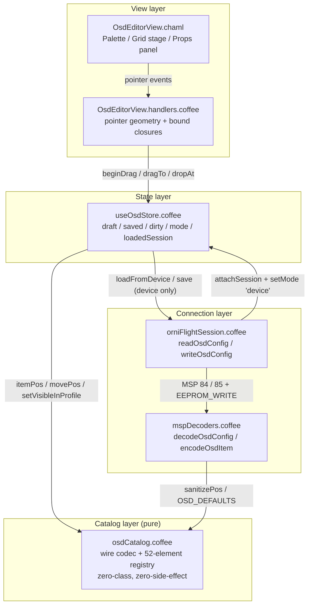
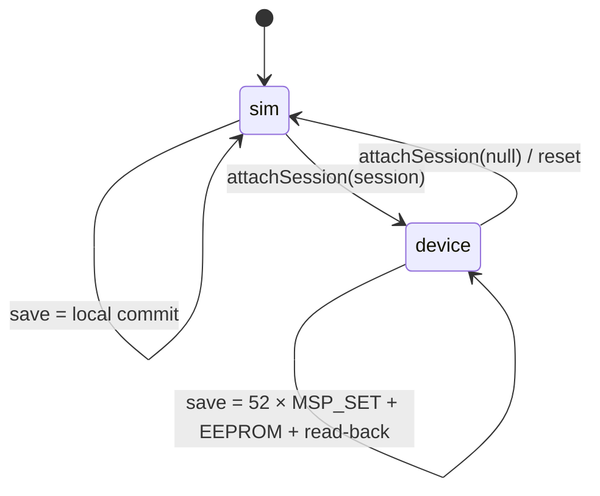

# OrniFlight Studio — OSD Editor

This document is the permanent record of the **OSD Editor** magnum opus: a
visual drag-and-drop surface for the on-screen-display layout of an OrniFlight
flight controller. It owns the polymorphic *draft ↔ commit* lifecycle, encodes
the layout as the raw wire format itself (no impedance between store and MSP),
and — only when a controller is attached — synchronizes through the MSP
session with item-wise writes and a read-back verification.

Companion documents:

- [`MSP-PROTOCOL.md`](MSP-PROTOCOL.md) — the byte-level MSPv2 layer beneath the
  session boundary described here.
- [`PID-TUNING-VIEW.md`](PID-TUNING-VIEW.md) and
  [`CONFIGURATION-VIEW.md`](CONFIGURATION-VIEW.md) — the sibling polymorphic
  stores; the draft/saved/mode pattern and the source-device pin are shared.

---

## 1. Architecture

The OSD Editor is **layered by responsibility**. A thin CHAML shell presents
*what* can be placed on the grid; a pure catalog module owns *how* the wire
format is interpreted; a single stateful store owns *how* edits flow; a session
boundary owns *where* they persist. Geometry is kept in a module-scope helper
table so it stays unit-testable without a DOM.



### Five responsibilities, five files

| File | Role | Statefulness |
|---|---|---|
| `src/components/views/OsdEditorView/OsdEditorView.chaml` | Palette, grid stage, props panel, toolbar, mode/dirty/error banners | Stateless (reads the store) |
| `src/components/views/OsdEditorView/OsdEditorView.handlers.coffee` | Pointer geometry (`cellFromPointer`) and stable handler closures | Module scope (built once) |
| `src/lib/osdCatalog.coffee` | Pure wire codec + enum-exact 52-element registry + defaults | Zero-state |
| `src/stores/useOsdStore.coffee` | The single source of truth for the layout document | Zustand store |
| `src/protocol/mspDecoders.coffee` / `orniFlightSession.coffee` | Wire codec + session read/write boundary | MSP layer |

`OsdEditorView.coffee` is a one-line `memo` wrapper around the CHAML. The view
is mounted at the `/osd` route in `src/app/App.chaml` (`osdEl`).

---

## 2. The wire format (the document IS the wire)

The store does not model a *UI object* and translate to MSP — it holds the raw
`u16[52]` item-position array exactly as the firmware does. This is the core
design decision: **no impedance mismatch between store and protocol.**

Each `item_pos` is a single `u16`:

| Bits | Meaning |
|---|---|
| `0..9` | Cell position — `x = pos & 0x1F`, `y = (pos >> 5) & 0x1F` (firmware `OSD_POS(x,y) = x | (y << 5)`) |
| `11..13` | Per-profile visibility — **bit SET = visible** in that profile (profile 1 at bit 11) |
| `14..15` | Unused — masked by `sanitizePos` |

Constants (`src/lib/osdCatalog.coffee`):

```
GRID_COLS = 30, GRID_ROWS = 16        # visible grid (UI)
OSD_ITEM_COUNT = 52                   # osd_items_e enum length
OSD_PROFILE_COUNT = 3                 # profiles 1..3
POSITION_XY_MASK = 0x1F
PROFILE_BITS_POS = 11
POSITION_MASK = 0x3FF                 # bits 0..9
PROFILE_MASK = 0x3800                 # bits 11..13
WIRE_MASK = POSITION_MASK | PROFILE_MASK   # 0x3BFF — everything the wire defines
```

The catalog is **pure** — zero-class, zero-side-effect — mirroring the firmware
ground truth exactly:

- `OrniFlight/src/main/osd/osd.h` — `enum osd_items_e` (52 entries, 0..51)
- `OrniFlight/src/main/osd/osd.c` — `pgResetFn_osdConfig` (defaults)
- `OrniFlight/src/main/msp/msp.c` — `MSP_OSD_CONFIG` / `MSP_SET_OSD_CONFIG`

### Catalog API

| Function | Behavior |
|---|---|
| `itemPos(x, y)` | Packs a cell into the low 10 bits |
| `posX(pos)` / `posY(pos)` / `posCell(pos)` | Unpack cell coordinates |
| `clampCell(x, y)` | Clamps non-finite/out-of-range coords into the 30×16 grid |
| `cellFromPointer(cx, cy, rect)` | Maps pointer coords onto a grid cell (pure — rect supplied) |
| `movePos(pos, x, y)` | Replaces only the low 10 bits; visibility flags survive |
| `sanitizePos(pos)` | Masks everything the wire does not define (bits 14..15) |
| `profileFlag(i)` | `1 << (11 + i - 1)` |
| `visibleInProfile(pos, i)` | Bit test (SET = visible) |
| `setVisibleInProfile` / `toggleVisibleInProfile` / `isVisible` | Visibility mutation |
| `findFreeCell(items)` | First unoccupied cell, row-major; `null` when full |

`OSD_ITEMS` is an enum-exact registry (index 0..51, key/label/glyph are UI
dressing only). `OSD_DEFAULTS` mirrors `pgResetFn_osdConfig`: every element at
`OSD_POS(10,7)` without profile bits (disabled), `WARNINGS` (index 21) enabled
in all profiles, and the three classic elements at fixed positions (crosshairs
`13,6`, artificial horizon `14,2`, horizon sidebars `14,6`).

---

## 3. The polymorphic store

`useOsdStore` is a Zustand store implementing a **layout document** with draft
and saved copies of the same `u16[52]` shape, a mode flag, and a **source pin**
(`loadedSession`).



### Document shape

```
{
  mode: 'sim' | 'device'
  session: OrniFlightSession | null
  loadedSession: OrniFlightSession | null   # the source pin
  draft: u16[52]                            # the working copy (the wire)
  saved: u16[52]                            # last committed copy
  profileIndex: 1..3                        # active profile
  dirty: boolean
  dragState: { index, origin, wasDirty } | null
  lastError: string | null
}
```

### API reference

| Action | Behavior |
|---|---|
| `setItemPos(index, x, y)` | Clamp + `movePos` (visibility preserved), `dirty=true` |
| `setItemVisible(index, profile, visible)` | Set/toggle a single profile bit |
| `toggleItemVisibility(index, profile=active)` | XOR the profile bit |
| `placeItem(index, cell)` | Move to cell **and** make visible in active profile (palette drop-in) |
| `setProfileIndex(i)` | 1..3 guarded |
| `beginDrag(index)` / `dragTo(x,y)` / `dropAt(x,y)` / `cancelDrag()` | Pointer lifecycle with clamp + origin restore |
| `save()` | sim → local normalize/commit; device → `writeOsdConfig` + read-back |
| `revert()` | Draft ← saved, clear dirty/drag/error |
| `setMode(mode)` | `'sim'` / `'device'` only |
| `attachSession(session)` | `null` → sim, else device |
| `loadFromDevice(session=current)` | Read, normalize, pin `loadedSession`, adopt device profile index |
| `reset()` | Back to firmware defaults in sim mode |

### The source-device pin

A device save requires a prior successful **read of that same session**:

```coffee
unless get().loadedSession == session
  throw new Error 'Read device OSD layout before saving'
```

This prevents values read from one craft from ever being written to a
different one. `loadFromDevice` sets `loadedSession = session`; `reset` and
`attachSession(null)` clear it.

---

## 4. Mode semantics — sim vs device

| | **sim** | **device** |
|---|---|---|
| On open | Firmware defaults, no persistence | `loadFromDevice()` reads MSP 84 |
| Drag/drop | Local only | Local draft, committed on Save |
| Save | `normalizeItems(draft)` → local commit | 52 × `MSP_SET_OSD_CONFIG` + `EEPROM_WRITE` + read-back |
| Without session | Always valid | `save` throws; banner shows the error |

The CHAML surfaces the mode via a badge (`SIMULATION` / `DEVICE`), an `UNSAVED`
dirty badge, an error banner, and a read-only "Read device" action in sim mode.
A sim banner reminds the user that changes are not persisted.

---

## 5. MSP synchronization path

### MSP 84 — `MSP_OSD_CONFIG` (read)

Wire layout (OrniFlight `msp.c`), decoded by `decodeOsdConfig`:

```
u8  osdFlags
u8  videoSystem
u8  units
u8  rssiAlarm
u16 capAlarm
u8  reserved
u8  itemCount
u16 altAlarm
itemCount × u16 item positions
-- adaptive trailer --
u8  statCount, statCount × u8
u8  timerCount, timerCount × u16
u16 warningsLow, u8 warningCount, u32 warningsFull
u8  profileCount
u8  profileIndex          # 1-based, reset = 1
u8  overlayRadioMode
```

### MSP 85 — `MSP_SET_OSD_CONFIG` (write)

The firmware accepts **exactly one element per request**:

```
[u8 index, u16 position, u8 screen]   # screen 1 = in-flight OSD screen
```

`writeOsdConfig` therefore writes the layout item-wise (52 sequential writes),
then flushes with `EEPROM_WRITE`, then **reads back** and compares slot-by-slot
via `osdItemsMatch`. Any mismatch throws `'OSD configuration read-back failed'`.

### Read-path robustness

- `decodeOsdConfig` **degrades instead of throwing** on any truncated/empty
  payload — a short MSP frame yields `osdConfigDefaults()`, never a crash.
- `encodeOsdItem` masks the index with `& 0xFF` (u8-safe).
- `writeOsdConfig` clamps `count = Math.min(items.length, OSD_ITEM_COUNT)` and
  slices to the wire-known slots.
- All `ByteReader` reads are guarded by `remaining()`.

---

## 6. Security invariants

| Invariant | Mechanism |
|---|---|
| No XSS surface | React escaping only; no `dangerouslySetInnerHTML`, no raw HTML injection |
| Undefined wire bits never set | `sanitizePos` masks to `WIRE_MASK` (bits 14..15 stripped) |
| Out-of-range mutations rejected | `validIndex` / `validProfile` guard every store action |
| Hole-free document | `normalizeItems` fills every missing slot with firmware defaults |
| Cross-craft write prevented | `loadedSession` source pin |
| Armed write refused | `writeOsdConfig` throws if `lastStatus.armed` |
| Oversized payload rejected | `decodeOsdConfig` clamps item count; `writeOsdConfig` clamps/slices |
| Non-finite coords neutralized | `clampCell` maps NaN/±Infinity to the origin |

---

## 7. Render-efficiency contract

The hot path is the pointer-drag loop. It is O(1) per move — no re-scan of the
grid, no DOM measurement inside the store:

- `cellFromPointer` is pure geometry over a cached bounding rect.
- `dragTo` short-circuits when the packed position is unchanged (a drag that
  ends where it started never dirties the document).
- The grid renders only `visibleItems` (filtered by `visibleInProfile`), not all
  52 slots.
- `OsdEditorView` is `memo`-wrapped; handler closures are built once per mount.

Measured (Step 9 benchmark): drag hotpath **0.9 µs/op** (~18 000× under the
60 Hz frame budget), full-config decode **6 µs/op**. The only real latency is
the device save — **54 sequential MSP roundtrips**, which the firmware mandates
(one element per `MSP_SET_OSD_CONFIG` request).

---

## 8. Testing

Four suites cover the subsystem (`src/test/`), part of the 393-test full run:

| Suite | Count | Focus |
|---|---|---|
| `osdCatalog.test.coffee` | 12 | Pack/unpack, firmware constants, clamp, profile flags, defaults, free-cell |
| `osdCodec.test.coffee` | 7 | Wire encode/decode, round-trip, truncation/oversize degradation, index masking |
| `OsdEditorView.test.coffee` | 9 | Render, palette place, select, pointer drag, cancel, props edit, profile switch |
| `useOsdStore.test.coffee` | 24 | Sim/device lifecycle, clamp, drag no-op/dirty, save/revert, session pin, error surfacing |

Run:

```bash
npx vitest run src/test/osdCatalog.test.coffee \
  src/test/osdCodec.test.coffee src/test/OsdEditorView.test.coffee \
  src/test/useOsdStore.test.coffee
```

The pointer tests use the `?.` guard on `setPointerCapture` so jsdom (which
lacks it) keeps the suite green without a shim.

---

## 9. Maintenance notes

- **Firmware ground truth** lives in `../OrniFlight` (`osd.h`, `osd.c`,
  `msp.c`). Any change to the OSD wire format or the element enum must be
  mirrored in `osdCatalog.coffee` and `mspDecoders.coffee` together — the codec
  comment block names the exact firmware source.
- **`profileIndex` is 1-based** on the wire (reset = 1, 0 = unavailable); the
  store clamps read values into `[1..3]`.
- **Visibility is inverted from intuition**: bit SET = visible (firmware
  `VISIBLE(x) = x & OSD_PROFILE_MASK`), the opposite of "hidden-in-profile"
  conventions. Do not "simplify" this.
- **Emoji glyphs in `OSD_ITEMS` are multibyte**; the `lint:width` check flags a
  handful of those registry lines, which are intentional one-entry-per-line data
  rows and remain aspirational (not a gate).
- **Save is firmware-serial**: 52 sequential `MSP_SET_OSD_CONFIG` writes. Do not
  batch these into one request — the firmware rejects multi-element SET frames.
- The read-back verification (`osdItemsMatch`) is strict slot equality; a
  firmware that sanitizes positions on write (e.g. masking bits 14..15) still
  matches because the store already writes only `WIRE_MASK`-clean values.
