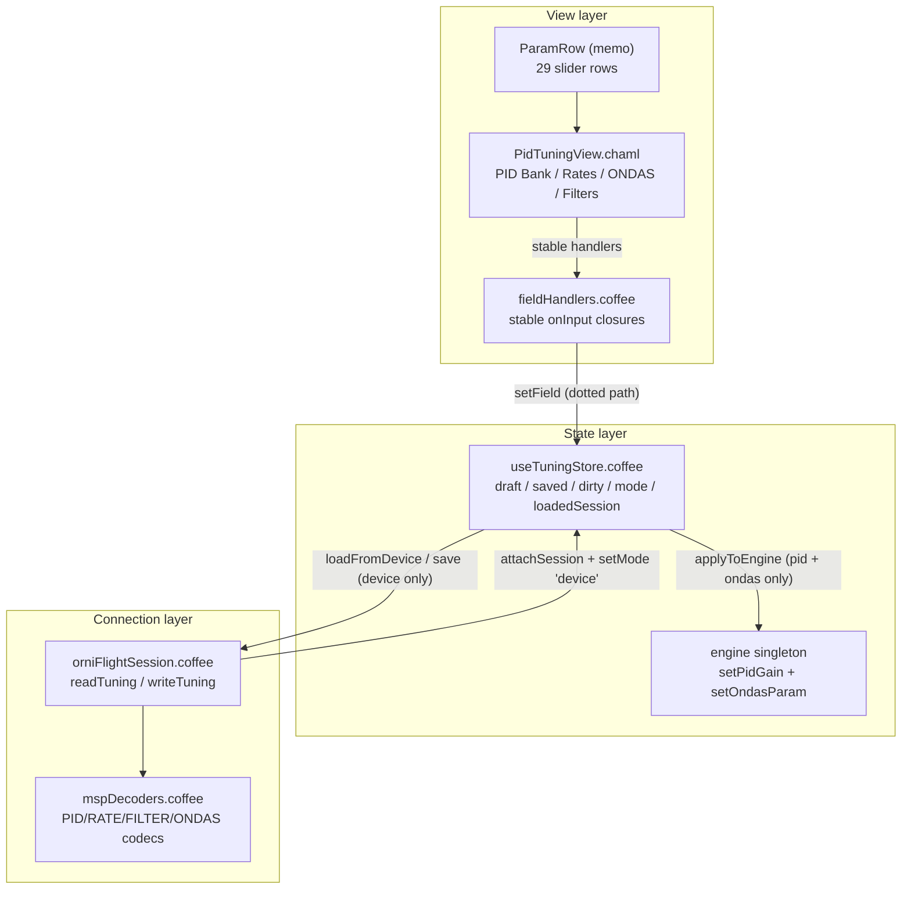

# OrniFlight Studio — PID Tuning View

This document is the permanent record of the **PID Tuning View** magnum opus:
the polymorphic flight-control tuning surface for PID gains, RC rates, ONDAS
waveform params, and filter configuration. It owns the *draft → commit*
lifecycle, mirrors every modeled edit into the live simulation engine, and —
only when a controller is attached — synchronizes tuning through the MSP
session with a section-wise read-back.

Companion documents:

- [`MSP-PROTOCOL.md`](MSP-PROTOCOL.md) — the byte-level MSPv2 layer beneath the
  session boundary described here.
- [`CONFIGURATION-VIEW.md`](CONFIGURATION-VIEW.md) — the sibling polymorphic
  store; the draft/saved/mode pattern and security invariants are shared.

---

## 1. Architecture

The PID Tuning View is **layered by responsibility**. A thin CHAML shell
presents *what* can be tuned; a single stateful store owns *how* edits flow and
normalize; a session boundary owns *where* they persist. A module-scope handler
table keeps the memoized row component fast.



### Four responsibilities, three files

| File | Role | Statefulness |
|---|---|---|
| `src/components/views/PidTuningView/PidTuningView.chaml` | Section shell, mode badge, dirty/error banners, action bar | Stateless (reads the store) |
| `src/components/views/PidTuningView/fieldHandlers.coffee` | Stable `onInput` closures for the memoized rows | Module scope (built once) |
| `src/stores/useTuningStore.coffee` | The single source of truth for the tuning document | Zustand store |

`PidTuningView.coffee` is a one-line `memo` wrapper around the CHAML. The view
is mounted as the **Flight Control** workspace (`controlEl` in
`src/app/App.chaml`).

---

## 2. The polymorphic store

`useTuningStore` is a Zustand store implementing a **tuning document** with
three copies of the same shape plus a mode flag and a **source pin**:

| Field | Meaning |
|---|---|
| `draft` | The working copy. Every `setField` mutates it and sets `dirty: true`. |
| `saved` | The last committed document. `revert()` copies it back into `draft`. |
| `dirty` | `true` when `draft ≠ saved`. Drives the UNSAVED badge and Revert enablement. |
| `mode` | `'sim'` (default) or `'device'`. Never assumed — the UI always reads it. |
| `session` | The attached `OrniFlightSession`, or `null` when offline. |
| `loadedSession` | The session the current document was read from. Pins a save to its source device. |
| `lastError` | Last read/write failure message, surfaced by the view. |

### Document shape

The document has four sections, each normalized on **every write** by
`normalizeDraft`:

```
draft
├── pid      # { roll, pitch, yaw, flap } × { P, I, D }  — floats
├── rate     # { rcRate, superRate, expo }               — integers
├── ondas    # 10 waveform keys                           — integers
└── filter   # { gyroDlpfHz, gyroNotchHz, gyroNotchQ, dTermDlpfHz }
```

Normalization is **per-section** (`normalizePid`, `normalizeRate`,
`normalizeOndas`, `normalizeFilter`), each rebuilding a fresh object from a
fixed key list. No attacker-supplied key ever passes through — the normalized
object contains only the keys named in the section's canonical list.

### Clamping invariants

| Section | Rule | Rationale |
|---|---|---|
| `pid` | `clampGain` → `[0, 65.535]` | PID gains ride a `u16×1000` wire field (MSP 112/202); `65.535 = 65535 / 1000` is the representable ceiling. |
| `rate` | `rcRate [0, 250]`, `superRate/expo [0, 100]` | Firmware-standard u8 ranges. |
| `ondas` | `[0, 100]` | Waveform mixer scales 0..100%. |
| `filter` | `Hz [0, 65535]`, `notchQ [0, 16]` | u16 Hz fields; u8 Q factor. |

All numeric coercions funnel through `finiteOr(fallback, value)`, which maps
`NaN`, `±Infinity`, `null`, and `undefined` to the section fallback while
preserving finite `0`. This keeps sim and device documents identical and
prevents encode-side truncation from surfacing as a read-back mismatch on save.

### Engine mirror

Edits to **`pid` and `ondas`** mirror into the `engine` singleton immediately so
the live simulation follows the draft:

- Nine modeled gains (`roll`, `pitch`, `yaw` × P/I/D) via `engine.setPidGain`.
- All ten ONDAS params via `engine.setOndasParam`.

The **flap axis and the rate/filter sections are document-only** — the sim does
not model them. `applyToEngine` skips those, avoiding 19 redundant writes per
edit. `MIRROR_AXES = ['roll', 'pitch', 'yaw']` is the single source of that
truth.

### API reference

| Method | Signature | Behavior |
|---|---|---|
| `setField(path, value)` | `('pid.roll.P', 5.5)` | Deep-set a dotted path, re-normalize the whole draft, mirror to engine (pid/ondas only), `dirty: true`. No-op on forbidden/malformed paths. |
| `save()` | `()` | Commit. Sim: local only. Device: write through `session.writeTuning`, then commit the read-back. Returns the saved doc. |
| `revert()` | `()` | Copy `saved` back into `draft`, re-mirror, `dirty: false`. |
| `setMode(mode)` | `('sim' | 'device')` | Throws on unknown mode. |
| `attachSession(session)` | `(sess | null)` | Bind/unbind the MSP session; `null` detaches to sim mode. |
| `loadFromDevice(session?)` | `(sess?)` | Read tuning over MSP, set mode `device`, pin `loadedSession`, clear dirty. |
| `reset()` | `()` | Restore `TUNING_DEFAULTS`, sim mode, no session/pin. |

`TUNING_DEFAULTS` is exported and `Object.freeze`-d; the store clones it on
creation so the frozen template is never mutated by accident. `PID_GAIN_MAX`
(`65.535`) is exported for the view's slider bounds.

---

## 3. Mode semantics — sim vs device

The store is **never allowed to assume a device is present**. Two modes gate
every side effect:

**`sim` (default)** — a dry-run. `save()` commits the draft locally and mirrors
it into the engine; no MSP traffic is generated. The view renders a
`SIMULATION — Werte werden nicht persistiert` banner. This is the only mode
available with the built-in simulation transport.

**`device`** — entered via `attachSession(session)` (which also sets
`mode: 'device'`) or `loadFromDevice()`. `save()` then writes all four sections
through `session.writeTuning`, which performs a
**SET ×4 → EEPROM_WRITE → read-back** roundtrip.

### The source-device pin

A device save requires a **prior successful read of that same session**. The
`loadedSession` field records which session produced the current document, and
`save()` refuses to write when `loadedSession !== session`:

```
Read device tuning before saving
```

This prevents values read from one craft from ever being written to a newly
connected one — the document can never leak across physical devices.

### Failure surfacing

Read/write failures throw, but first record `error.message` into `lastError`,
which the view renders in a `.tuning-error` banner. `lastError` clears on the
next successful `save`/`revert`/`loadFromDevice`/`reset`.

---

## 4. Wire protocol

All traffic rides the existing MSPv2 session boundary; the store never speaks
MSP directly. Command IDs are registered in `mspCodes.coffee`, codecs live in
`mspDecoders.coffee`.

| Section | Read | Write | Wire layout |
|---|---|---|---|
| PID | `PID` (112) | `SET_PID` (202) | 24 B — roll→pitch→yaw→flap, each P/I/D `u16×1000` LE |
| RC tuning | `RC_TUNING` (111) | `SET_RC_TUNING` (204) | 3 B — `rcRate`, `superRate`, `expo` u8 |
| Filter | `FILTER_CONFIG` (92) | `SET_FILTER_CONFIG` (193) | 7 B — `gyroDlpfHz` u16, `gyroNotchHz` u16, `gyroNotchQ` u8, `dTermDlpfHz` u16 |
| ONDAS | `ONDAS` (114) | `SET_ONDAS` (206) | 10 B — one u8 per key in `ONDAS_KEYS` order |
| — | — | `EEPROM_WRITE` (250) | Sent once after all four SETs |

The PID `×1000` scaling keeps gain steps of `0.001` lossless on the wire.
`writeTuning` verifies the roundtrip with `tuningSectionMatches`: PID compares
at wire precision (`Math.round(v × 1000)`), the remaining integer sections
compare structurally (`JSON.stringify`).

### Read fallbacks

`readTuning` uses `requestOptional` per command; a controller that does not
expose a section falls back to its defaults so the document is always complete.
Fallbacks are shared between the session and the store via `TUNING_FALLBACKS`
(and `ONDAS_DEFAULTS`), so defaults can never drift between the two.

| Default | Values |
|---|---|
| `pid` | roll `4.0 / 0.03 / 23.0`, pitch `6.0 / 0.04 / 28.0`, yaw `3.0 / 0.05 / 0.0`, flap `0 / 0 / 0` |
| `rate` | `rcRate 100`, `superRate 0`, `expo 0` |
| `ondas` | `cadence_gain 30`, `ferocity_d_gain 40`, `ferocity_p_gain 20`, `balance_gain 10`, `ferocity_roll_gain 30`, `ferocity_yaw_gain 25`, `warp_gain 20`, `warp_yaw_gain 15`, `anchor_gain 50`, `resonance_gain 10` |
| `filter` | all `0` |

---

## 5. Render-efficiency contract

`ParamRow` is `memo`-ized. A fresh `onInput` closure per render would defeat the
memo and re-render all **29 rows** on every keystroke. `fieldHandlers.coffee`
solves this by building four handler tables **once at module scope**
(`pidHandlers`, `ondasHandlers`, `rateHandlers`, `filterHandlers`), each closure
reaching the store imperatively via `useTuningStore.getState().setField`.

The result is **one re-render per edit** — only the edited row, not all 29.
This is proven by `PidTuningView.perf.test.coffee`, which mocks `ParamRow` with a
render counter and asserts a single row re-renders after a slider input.

The PID bank is `defaultOpen: true` inside a framer-motion accordion. A test
that clicks all accordion triggers — including the already-open PID bank — would
**close** it; with a mocked `requestAnimationFrame` the exit animation never
completes, leaving a stale snapshot whose rows can never re-render. The probe
therefore opens only the sections with `aria-expanded == 'false'`.

---

## 6. Security invariants

| Invariant | Mechanism |
|---|---|
| Prototype-pollution guard | `FORBIDDEN_SEGMENTS = {'__proto__', 'constructor', 'prototype'}`; `validPath` rejects any dotted-path segment in the set before `setField` traverses or writes. |
| No attacker key pass-through | Every normalizer builds a fresh object from a fixed key list (`PID_AXES`, `PID_TERMS`, `ONDAS_KEYS`). |
| Non-finite coercion | `finiteOr(fallback, value)` maps `NaN`/`±Infinity`/`null`/`undefined` to fallbacks, preserving finite `0`. |
| Wire-ceiling clamp | `PID_GAIN_MAX = 65.535` prevents encode-side truncation from becoming a silent read-back mismatch. |
| Armed guard | `writeTuning` throws `Cannot write configuration while armed` if `lastStatus.armed`. |
| Source-device pin | `loadedSession` blocks cross-device writes (see §3). |
| Read-back verification | `writeTuning` compares every section after `EEPROM_WRITE`. |
| No XSS surface | The view renders values only through controlled components and `textContent`-style interpolation; no `dangerouslySetInnerHTML`, no string-built HTML. |

---

## 7. Testing

| Suite | Coverage |
|---|---|
| `src/test/useTuningStore.test.coffee` | Defaults/dirty init, nested path edits, engine mirror (9 gains + 10 ondas, flap/rate/filter excluded), non-finite guards, range clamps, prototype-pollution rejection, primitive-leaf descent, revert, sim save, device save, save-refusal without session/without read, `lastError` surfacing, mode validation, detach-to-sim, device read, wire-ceiling clamp on both sim and device paths. |
| `src/test/PidTuningView.test.coffee` | Four sections in sim mode, 12 PID + 3 rate + 10 ondas + 4 filter rows, UNSAVED badge, DEVICE badge without sim banner, Save/Revert interactions. |
| `src/test/PidTuningView.perf.test.coffee` | The ParamRow memo contract: only the edited row re-renders. |

Run the full gauntlet:

```bash
PATH="$HOME/.nvm/versions/node/v22.17.1/bin:$PATH" npx vitest run
PATH="$HOME/.nvm/versions/node/v22.17.1/bin:$PATH" npm run lint:width
```

---

## 8. Maintenance notes

- **Adding a section** means touching five places: the normalizer in
  `useTuningStore.coffee`, the handler table in `fieldHandlers.coffee`, the
  CHAML section block, the codec pair in `mspDecoders.coffee` (plus MSP IDs in
  `mspCodes.coffee`), and the read/write paths in `orniFlightSession.coffee`
  (including `tuningSectionMatches` if the new section is non-integer).
- **Extending the engine mirror** — if the sim ever models rates/filters/flap,
  extend `MIRROR_AXES` (or add a new mirror branch) and update the store header
  comment that documents the mirror boundary.
- **Never** replace the module-scope handlers with per-render closures — that
  silently breaks the `ParamRow` memo and re-renders all 29 rows per keystroke.
  The perf test is the tripwire.
- **Never** remove `loadedSession` without re-adding an equivalent cross-device
  guard — it is the one barrier between a tuned draft and the wrong aircraft.
