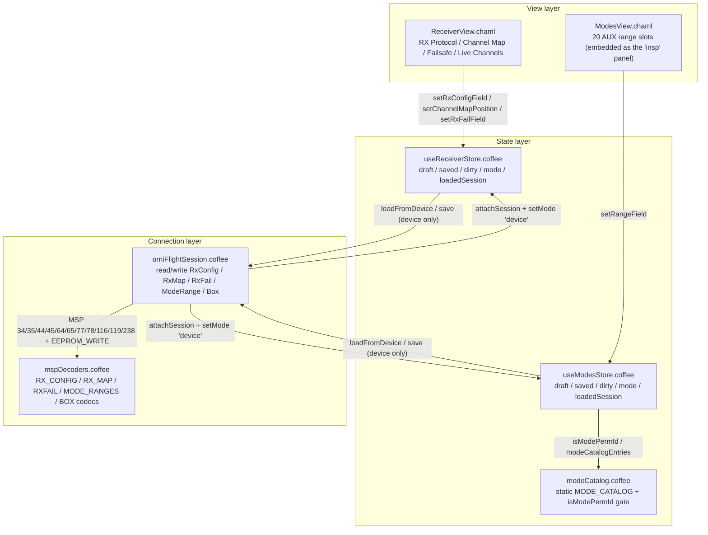

# OrniFlight Studio — Receiver & Modes

This document is the permanent record of the **Receiver & Modes** magnum opus:
the polymorphic surface for the serial RX chain and the AUX flight-mode
assignment of an ornithopter. It owns the *draft → commit* lifecycle across two
wire documents — the receiver document (RX_CONFIG / RX_MAP / RXFAIL) and the
mode-range document (MODE_RANGES / MODE_RANGES_EXTRA) — merges the firmware box
list over a static catalog, and — only when a controller is attached —
synchronizes through the MSP session with per-record writes and a read-back
verification.

Companion documents:

- [`MSP-PROTOCOL.md`](MSP-PROTOCOL.md) — the byte-level MSPv2 layer beneath the
  session boundary described here.
- [`PID-TUNING-VIEW.md`](PID-TUNING-VIEW.md) and
  [`CONFIGURATION-VIEW.md`](CONFIGURATION-VIEW.md) — the sibling polymorphic
  stores; the draft/saved/mode pattern, the source-device pin, and the security
  invariants are shared.
- [`SERVOS-VIEW.md`](SERVOS-VIEW.md) — the servo & wing-mapping surface; shares
  the draft/saved/mode pattern and the armed-guard write discipline.
- [`FAILSAFE-ARMING.md`](FAILSAFE-ARMING.md) — the safety surface
  (failsafe, arming, features, beeper); shares the draft/saved/mode
  pattern and the armed-guard write discipline.

---

## 1. Architecture

The Receiver & Modes surface is **layered by responsibility**. Two thin CHAML
shells present *what* can be configured; two stateful stores own *how* edits
flow and clamp; a session boundary owns *where* they persist. `ModesView` is
both a standalone route and the embedded `insp` panel of `ReceiverView`, so the
mode document rides alongside the receiver document in one combined surface.



### Responsibilities, file by file

| File | Role | Statefulness |
|---|---|---|
| `src/components/views/ReceiverView/ReceiverView.chaml` | Mode/dirty badges, action bar, RX Protocol / Channel Map / Failsafe / Live Channels panels | Stateless (reads the store) |
| `src/components/views/ModesView/ModesView.chaml` | Flight Modes note, Range Logic note, 20 AUX range rows | Stateless (reads the store) |
| `src/stores/useReceiverStore.coffee` | Single source of truth for the receiver document | Zustand store |
| `src/stores/useModesStore.coffee` | Single source of truth for the mode-range document | Zustand store |
| `src/lib/modeCatalog.coffee` | Static ornithopter-filtered flight-mode box index | Pure module |
| `src/protocol/mspDecoders.coffee` / `orniFlightSession.coffee` | Wire codec + session read/write boundary | MSP layer |

`ReceiverView` is mounted at the `/receiver` route in `src/app/App.chaml`
(`receiverEl = h(AnimatedPage, null, h(ReceiverView, null))`); `ModesView` is
mounted both at `/modes` and as the `insp` `ViewArea` inside `ReceiverView`.
RX config fields render through the memoized `ParamRow` slider primitive; mode
ranges use native range/select inputs with `intFromEvent` / `valueFromEvent`
closures.

---

## 2. Wire format ground truth

The Receiver & Modes surface spans **five MSP surfaces**. All layouts below were
verified against the OrniFlight firmware (`src/main/msp/msp.c`, API 1.47).

### MSP codes

| Code | MSP id | Direction | Purpose |
|---|---|---|---|
| `RX_CONFIG` | 44 | read | Serial RX configuration document |
| `SET_RX_CONFIG` | 45 | write | 16-byte RX_CONFIG document |
| `RX_MAP` | 64 | read | Channel map (letter index per logical input) |
| `SET_RX_MAP` | 65 | write | 8-byte channel map |
| `RXFAIL_CONFIG` | 77 | read | Per-channel failsafe stream |
| `SET_RXFAIL_CONFIG` | 78 | write | Index-prefixed failsafe slot |
| `MODE_RANGES` | 34 | read | 20 × 4-byte mode activation slots |
| `SET_MODE_RANGE` | 35 | write | Index-prefixed mode range (7 bytes) |
| `MODE_RANGES_EXTRA` | 238 | read | Optional logic/link extension |
| `BOXNAMES` | 116 | read | `;`-separated box names (paged) |
| `BOXIDS` | 119 | read | permanentId array (paged) |
| `EEPROM_WRITE` | 250 | write | Persist after every mutation |

### RX_CONFIG — 16 bytes

| Offset | Type | Field | Notes |
|---|---|---|---|
| 0 | u8 | `provider` | `SERIALRX_PROVIDERS` id |
| 1 | u16 | `maxcheck` | LE |
| 3 | u16 | `midrc` | LE |
| 5 | u16 | `mincheck` | LE |
| 7 | u8 | `spektrumSatBind` | |
| 8 | u16 | `rxMinUsec` | LE |
| 10 | u16 | `rxMaxUsec` | LE |
| 12 | u8 | `rcInterpolation` | |
| 13 | u8 | `rcInterpolationInterval` | |
| 14 | u16 | `airModeActivateThreshold` | wire = value × 10 + 1000 |

`RX_CONFIG_BYTES = 16`. The decoder is `remaining()`-guarded: the trailing
fields degrade to ornithopter defaults when a legacy firmware emits a shorter
stream (e.g. `rxMinUsec` → 885, `airModeActivateThreshold` → 0).

### RX_MAP — 8 bytes

`rcmap[logicalInput]` carries the **letter index** of the assigned physical
channel; the display map is its inversion as letters. The default wire
`[0,1,3,2,4,5,6,7]` reads back as `'AETR1234'`. `RC_CHANNEL_LETTERS` is
`'AERT12345678abcdefgh'` — 18 letters where `A=0 … h=17` — serving both as the
physical channel table and the map alphabet. `RX_MAPPABLE_CHANNEL_COUNT = 8`,
`MAX_SUPPORTED_RC_CHANNEL_COUNT = 18`.

### RXFAIL_CONFIG — dynamic channel stream

`{mode u8, value u16}` per channel; the firmware emits only its runtime
`channelCount` slots. `RXFAIL_MODE = {AUTO:0, HOLD:1, SET:2, INVALID:3}`. The
value domain is `750 µs + step × 25 µs` (`RXFAIL_VALUE_MIN = 750`,
`RXFAIL_STEP = 25`, step 0..60 → 750…2250 µs).

### MODE_RANGES — 20 fixed 4-byte slots

| Offset | Type | Field |
|---|---|---|
| 0 | u8 | `permanentId` |
| 1 | u8 | `auxChannelIndex` |
| 2 | u8 | `startStep` |
| 3 | u8 | `endStep` |

`MAX_MODE_ACTIVATION_CONDITION_COUNT = 20`. The band domain is
`MODE_RANGE_USEC_MIN = 900 µs + step × 25 µs` (step 0..48 → 900…2100 µs).
Activation is **half-open** `[start, end)`: a range fires while
`channelValue < 900 + endStep × 25`. A slot is usable only when it carries a
non-degenerate band (`startStep < endStep`), mirroring the firmware
`IS_RANGE_USABLE` macro.

### MODE_RANGES_EXTRA — optional logic/link extension

`u8 count` then `count × 3` bytes `{permanentId, modeLogic, linkedToPermId}`
aligned to the slot index they describe. Legacy firmware answers `MODE_RANGES`
only; extras decode to `null`, signalling the degraded mode (no AND/OR/XOR and
linked-box columns).

### BOXIDS / BOXNAMES — paged catalogs

Both take a `page` parameter. `BOXIDS` returns a `u8 permanentId` array;
`BOXNAMES` returns `u8 count` followed by `;`-separated names trimmed and
capped to `count`.

---

## 3. The polymorphic stores

Two Zustand stores implement the receiver and mode documents with the shared
*draft / saved / mode / session / loadedSession* shape:

```coffee
draft:   { ...document }              # editable copy
saved:   { ...document }              # last committed copy
mode:    'sim' | 'device'             # polymorphic switch
session: OrniFlightSession | null     # device transport
loadedSession: false                  # source pin — device read happened?
dirty:   false                        # draft diverges from saved
```

- **`mode: 'sim'`** — commits locally, never touches MSP.
- **`mode: 'device'`** — `loadFromDevice()` reads the surfaces; `save()` writes
  them with read-back; the `loadedSession` guard forces a read first so a
  foreign device is never overwritten by an unloaded draft.

The receiver draft is `{provider, maxcheck, midrc, mincheck, spektrumSatBind,
rxMinUsec, rxMaxUsec, rcInterpolation, rcInterpolationInterval,
airModeActivateThreshold, channelMap, rxFail[18]}`; the mode draft is
`{ranges[20], extrasAvailable}`.

### Clamp domains

| Domain | Range | Fields |
|---|---|---|
| `PROVIDER_LIMITS` | 0–12 | `provider` |
| `CHECK_LIMITS` | 500–2500 | `maxcheck` / `midrc` / `mincheck` |
| `USEC_LIMITS` | 500–3000 | `rxMinUsec` / `rxMaxUsec` |
| `THRESHOLD_LIMITS` | 0–250 | `airModeActivateThreshold` |
| `INTERPOLATION_LIMITS` | 0–255 | `rcInterpolation` / `rcInterpolationInterval` |
| `BIND_LIMITS` | 0–255 | `spektrumSatBind` |
| `RXFAIL_STEP_MAX` | 0–60 | failsafe `step` |
| `AUX_CHANNEL_LIMITS` | 0–13 | `auxChannelIndex` (AUX1…AUX14) |
| `LOGIC_LIMITS` | 0–2 | `modeLogic` (AND/OR/XOR) |
| `PERM_ID_LIMITS` | 0–255 | `permanentId` / `linkedToPermId` |
| `MODE_RANGE_STEP_MAX` | 0–48 | `startStep` / `endStep` |

`finiteOr(fallback, value)` collapses `NaN` / `±Infinity` / `null` / `undefined`
to the fallback while preserving finite `0`; `clampInt` rounds and clamps.

### The mode catalog

`modeCatalog.coffee` is a static, ornithopter-filtered index of flight-mode
boxes by permanent id (`MODE_CATALOG`, 30 boxes from ARM/ANGLE/HORIZON through
the ornithopter-specific ORNI_INDEP/ORNI_GLIDE/ORNI_PROFILE). `isModePermId`
gates every `permanentId` / `linkedToPermId` edit through this closed
vocabulary — a foreign or `NaN` id never dirties the draft. `modeCatalogEntries`
orders the dropdown (safety-critical and ornithopter boxes first);
`ACRO_HINT` marks Acro as **implicit** — the default when no range is active —
so it never appears as a range row. In device mode the firmware box list
(MSP 119) merges over the catalog: permanent ids stay authoritative, display
names refresh.

### The empty-slot signal

ARM (`BOXARM`, permanentId 0) is a **real** flight-mode box — never a sentinel.
A slot is empty only when `startStep == endStep` (zero-width band). The store's
`isRangeUsable` and the view's `rangeActive` therefore gate on band width alone,
never on `permanentId != 0`, so ARM remains assignable and writable.

---

## 4. Session boundary

All write paths share four invariants:

1. **Armed guard** — `throw` if `@lastStatus?.armed`.
2. **Index validation** — integer range check before encoding.
3. **EEPROM write** — `MSP_CODES.EEPROM_WRITE` after every mutation.
4. **Read-back verification** — re-read and compare before returning.

| Method | MSP | Read-back scope |
|---|---|---|
| `readRxConfig` / `writeRxConfig` | 44 / 45 + 250 | only supplied keys (threshold rounded to 0.1) |
| `readRxMap` / `writeRxMap` | 64 / 65 + 250 | all 8 positions; refreshes live `@rxMap` |
| `readRxFailConfig` / `writeRxFailChannel` | 77 / 78 + 250 | written slot, when the firmware reports it |
| `readModeRanges` / `writeModeRange` | 34+238 / 35 + 250 | the 4 base slot fields |
| `readBoxIds` / `readBoxNames` | 119 / 116 | paged reads, no write |

**Mode extras degrade gracefully.** `readModeRanges` probes `MODE_RANGES_EXTRA`
as optional; `null` extras means legacy firmware and the store carries
`extrasAvailable: false` (logic/link ride their defaults).

**The 255 no-link clamp.** On the wire, `linkedToPermId == 255` means "no link";
`writeModeRange` clamps it to the ARM-neutral 0 before encoding, and rejects a
`permanentId` that is missing or 255.

**Dynamic RXFAIL streams.** `writeRxFailChannel` verifies the written slot only
when `index < readBack.length` — a firmware reporting fewer runtime channels
passes rather than spuriously failing.

---

## 5. Security invariants (Validatio)

The Validatio audit (commit `f8553fb`) confirmed the defence-in-depth layers:

- **XSS-free surface** — zero `dangerouslySetInnerHTML` / `innerHTML` / `eval` /
  `Function` / `document.write` sinks project-wide. Firmware-derived strings
  (box names, provider labels) render exclusively as React text nodes.
- **Prototype-pollution whitelists** — `setRangeField` routes only
  `RANGE_FIELDS`; `permanentId` / `linkedToPermId` additionally pass the
  numeric `isModePermId` catalog gate (NaN-safe — `'__proto__'` / `NaN` never
  reach the wire). `setRxConfigField` routes `RX_FIELD_NAMES`;
  `setChannelMapPosition` gates on `RC_CHANNEL_LETTERS`; `setRxFailField` on
  `mode`/`step`. JSON-clone drafts strip prototypes.
- **Armed guard** — all four writes (`writeRxConfig` / `writeRxMap` /
  `writeRxFailChannel` / `writeModeRange`) block while armed.
- **Wire-domain validation** — `writeModeRange` validates `index 0..19` plus a
  `permanentId` that is an integer and not 255; out-of-domain values fail loudly
  via read-back mismatch rather than corrupting silently.
- **Bounded reader** — `ByteReader` is `require`-bounded; MSP-frame-bounded
  payloads admit no pathological allocations.
- **Minimal persistence** — `zustand`-persist `partialize` stores only view
  prefs (tabs/plots); no connection or telemetry data reaches `localStorage`.
- **Fail-loud read/save** — the shared `log = (label) -> (error) ->
  console.error label, error` helper catches read/save rejections; the dirty
  badge survives a failed save, so a silent data-loss impression is impossible.

---

## 6. Performance profile

Validation from the Validatio pass:

- **Poll loop** — 100 ms (`POLL_INTERVAL_MS`); the views subscribe through the
  selector `useTelemetryStore (state) -> state.rcChannels`, so the 10 Hz
  reconcile touches only ~200 vnodes (20 mode rows × 2 sliders + 2 selects, 18
  rxfail rows, 18 channel bars) — live readout by design, no re-render on other
  telemetry fields.
- **Codec allocations** — `decodeRxConfig` / `decodeModeRanges` /
  `decodeRxFailConfig` / `decodeBoxNames` allocate once per read (load path, not
  poll path); encoders use fixed 16/7/4-byte buffers.
- **Write batching** — Modes save = 20 × `SET_MODE_RANGE` + `EEPROM_WRITE`
  (firmware-mandated one range per request); Receiver save = 1 `RX_CONFIG` +
  1 `RX_MAP` + 18 `RXFAIL`, each with read-back — sequential, bounded, fail-loud.
- **Store actions** — JSON-clone of a 20-range draft per input event (µs scale),
  consistent with the sibling stores.

---

## 7. Testing

- `src/test/useReceiverStore.test.coffee` — receiver store invariants: sim-mode
  defaults, clamp domains, unknown/inherited field rejection, channel-map letter
  validation, failsafe step domain, revert, local sim commit, `loadedSession`
  guard, device load/save, non-finite degradation.
- `src/test/useModesStore.test.coffee` — modes store invariants: 20 empty slots,
  catalog assignment + clamp, foreign permanent-id rejection, unknown/inherited
  field rejection, out-of-range indices, revert, local sim commit, device
  load/save, extras degradation, the ARM sentinel / zero-width-band boundary
  contracts.
- `src/test/receiverModes.integration.test.coffee` — full device-path: load →
  edit → save through the wire for both documents, plus the guard rejection.
- `src/test/ReceiverView.test.coffee` — route render, SIMULATION badge, embedded
  ModesView (20 rows), read/save disabling, edit → dirty flows, and the two
  fail-loud tests (failed device save logs instead of rejecting silently).

Full suite: **501/501 green** across 38 files.

---

## 8. Troubleshooting

| Symptom | Cause | Resolution |
|---|---|---|
| `Read the device before writing — the draft may belong to another craft` | `loadedSession` source pin unset | Call `loadFromDevice()` before `save()` in device mode |
| `No device session attached` | `save()`/`loadFromDevice()` in device mode with no session | `attachSession(session)` first |
| `Cannot write configuration while armed` | Controller is armed | Disarm before configuration writes |
| `RX map must carry 8 channel positions` | Malformed map payload | Rebuild the map from a valid `'AETR1234'`-shaped letter string |
| `Mode range index out of range` / `permanentId missing or invalid` | Slot outside 0..19 or id 255 on the wire | Confirm the index and permanentId are catalog-valid |
| `Mode range read-back failed at index N` | Write landed, re-read mismatched (foreign/stale device) | Re-read the device and re-apply |
| `RX configuration read-back failed: <field>` | Field mismatch after write (provider-specific defaults) | Re-read and re-apply; the read-back verifies only supplied keys |
| `Legacy firmware — logic and links ride at their defaults` | `MODE_RANGES_EXTRA` answered null | Flash firmware with the MSP 238 extension |

---

## 9. Integration notes

- `ModesView` is **both** the `/modes` route and the `insp` panel of
  `ReceiverView`, so the two documents cohabit one surface while keeping
  independent stores and save boundaries.
- `modeCatalog.coffee` is a new pure module — zero classes, zero side effects —
  exporting `MODE_CATALOG`, `MODE_PRIORITY`, `modeCatalogEntries`,
  `isModePermId`, and `ACRO_HINT`.
- `SERIALRX_PROVIDERS` (13 providers) is CRSF-first with id 9 as the default —
  ELRS / TBS Crossfire sits atop the ornithopter-first ordering; the remaining
  providers follow the firmware `rx.h` enumeration.
- `MODE_RANGES_EXTRA` (238) is optional by design; the store degrades to the
  legacy four-field slot when the firmware does not expose logic/link columns.
- `writeRxMap` refreshes the session's live `@rxMap` and `@identity.rxMap` after
  a verified write, so the poll loop resolves live channels through the new
  assignment immediately.
