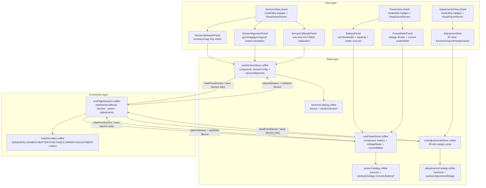

# OrniFlight Studio — Sensors, Power & Adjustments

This document is the permanent record of the **Sensors, Power & Adjustments**
magnum opus: the polymorphic telemetry-core configuration surface of an
ornithopter. It owns the *draft → commit* lifecycle across **three independent
flat wire-document families** — sensor selection (`SENSOR_CONFIG` /
`SET_SENSOR_CONFIG` + `SENSOR_ALIGNMENT` / `SET_SENSOR_ALIGNMENT`), power
(`BATTERY_CONFIG`, `VOLTAGE_METER_CONFIG`, `CURRENT_METER_CONFIG` and their
SET counterparts), and in-flight adjustments (`ADJUSTMENT_RANGES` /
`SET_ADJUSTMENT_RANGE`) — clamps every edit through a pure catalog, and only
when a controller is attached synchronizes through the MSP session with a
SET + `EEPROM_WRITE` + read-back verification per sub-document. Calibration is
the one exception: a one-shot `ACC_CALIBRATION` / `MAG_CALIBRATION` request with
no staging, no EEPROM write, and no read-back.

The surface is **ornithopter-first** throughout. Power exposes only the onboard
ADC meters — the OrniFlight target compiles out `USE_VIRTUAL_CURRENT_METER` and
`USE_ESC_SENSOR`, so the virtual/ESC/MSP current sources are listed but marked
unsupported. Adjustments mirror the full 30-slot `defaultAdjustmentConfigs`
table, but only four slots (`MAX_SIMULTANEOUS_ADJUSTMENT_COUNT`) can be active
at once — the hardware knob budget of a flapping-wing craft.

Companion documents:

- [`MSP-PROTOCOL.md`](MSP-PROTOCOL.md) — the byte-level MSPv2 layer beneath the
  session boundary described here.
- [`PID-TUNING-VIEW.md`](PID-TUNING-VIEW.md) and
  [`RECEIVER-MODES.md`](RECEIVER-MODES.md) — the sibling polymorphic stores;
  the draft/saved/dirty/mode pattern, the source-device pin, and the security
  invariants are shared.
- [`FAILSAFE-ARMING.md`](FAILSAFE-ARMING.md) — the safety-configuration surface;
  shares the armed-guard write discipline and the read-back verification idiom.
- [`VTX-PORTS.md`](VTX-PORTS.md) — the VTX & serial-port surface; another
  member of the same polymorphic store family.

---

## 1. Architecture

The Sensors/Power/Adjustments surface is **layered by responsibility**. Three
thin CHAML shells present *what* can be configured (six panels across three
routes); three stateful stores own *how* edits flow and clamp; three pure
catalogs own *what is legal* (hardware enums, meter sources, adjustment
functions, wire bounds); a session boundary owns *where* they persist. The
three domains are independent — the firmware performs no arbitration between
them, so neither does the studio.



### Responsibilities, file by file

| File | Role | Statefulness |
|---|---|---|
| `src/components/views/SensorsView/SensorsView.chaml` | Mode/dirty badges, error alert, action bar, hosts the three sensor panels | Stateless (reads the store) |
| `src/components/views/PowerView/PowerView.chaml` | Mode/dirty badges, error alert, action bar, hosts the two power panels | Stateless (reads the store) |
| `src/components/views/AdjustmentsView/AdjustmentsView.chaml` | Mode/dirty badges, error alert, action bar, renders all 30 `AdjustmentRow` slots | Stateless (reads the store) |
| `src/components/panels/SensorHardwarePanel/SensorHardwarePanel.chaml` | Acc/baro/mag chip select (MSP 96/97) | Stateless |
| `src/components/panels/SensorAlignmentPanel/SensorAlignmentPanel.chaml` | Gyro/mag/gyro1/gyro2 board orientation (MSP 126/220) | Stateless |
| `src/components/panels/SensorCalibratePanel/SensorCalibratePanel.chaml` | One-shot ACC/MAG calibration buttons with armed-lock | Local `useState` feedback only |
| `src/components/panels/BatteryPanel/BatteryPanel.chaml` | Cell thresholds, capacity, meter sources (MSP 32/33) | Stateless |
| `src/components/panels/PowerMeterPanel/PowerMeterPanel.chaml` | Voltage divider + current scale/offset (MSP 40/41, 56/57) | Stateless |
| `src/components/panels/AdjustmentRow/AdjustmentRow.chaml` | One slot: function/slot/channel/range/switch (MSP 52/53) | Stateless |
| `src/lib/sensorsCatalog.coffee` | Acc/baro/mag hardware, alignment enums, defaults, sanitizers | Pure (zero class) |
| `src/lib/powerCatalog.coffee` | Meter sources, wire constants, defaults, sanitizers | Pure (zero class) |
| `src/lib/adjustmentsCatalog.coffee` | Adjustment functions, slots, step→µs helpers, sanitizer | Pure (zero class) |
| `src/stores/useSensorsStore.coffee` | Compound draft: `sensorConfig` + `sensorAlignment` | Stateful (Zustand) |
| `src/stores/usePowerStore.coffee` | Compound draft: `battery` + `voltageMeter` + `currentMeter` | Stateful (Zustand) |
| `src/stores/useAdjustmentsStore.coffee` | Full 30-slot `ranges` array draft | Stateful (Zustand) |
| `src/protocol/orniFlightSession.coffee` | `read*/write*/calibrate*` per document + read-back verify | Stateful (session) |
| `src/protocol/mspDecoders.coffee` | Typed codecs + field-wise `*Matches` helpers | Pure |

---

## 2. Wire format ground truth

All byte layouts are verified against the OrniFlight firmware headers
(`sensors/acceleration.h`, `sensors/barometer.h`, `sensors/compass.h`,
`drivers/sensor.h`, `sensors/voltage.{h,c}`, `sensors/current.{h,c}`,
`sensors/battery.c`, `fc/rc_adjustments.{h,c}`, `fc/rc_modes.c`,
`msp/msp.c`).

### Sensors — MSP 96/97 and 126/220

- **`SENSOR_CONFIG` (96) / `SET_SENSOR_CONFIG` (97)** — a flat 3-byte record:
  `accHardware` (u8), `baroHardware` (u8), `magHardware` (u8). Firmware default
  is 0 (auto-detect) everywhere.
- **`SENSOR_ALIGNMENT` (126)** — a **7-byte read** record:
  `gyroAlign, accAlign, magAlign, gyroDetectionFlags, gyroToUse, gyro1Align,
  gyro2Align`.
- **`SET_SENSOR_ALIGNMENT` (220)** — a **6-byte write** record. The deprecated
  `accAlign` byte and the read-only `gyroDetectionFlags` never travel back;
  the decoder/encoder split on a `remaining() >= 7` probe so the same codec
  serves both directions.
- **`ACC_CALIBRATION` (205)** / **`MAG_CALIBRATION` (206)** — one-shot
  commands; `206` is **both** `SET_ONDAS` and `MAG_CALIBRATION` in the
  firmware, so the keys coexist and consumers must never dispatch by 206 alone.

### Power — MSP 32/33, 40/41, 56/57

- **`BATTERY_CONFIG` (32) / `SET_BATTERY_CONFIG` (33)** — a 13-byte record:
  legacy u8 trio `((value + 5) / 10)` for min/max/warning cell voltage, then
  u16 `capacityMah`, u8 `voltageMeterSource`, u8 `currentMeterSource`, then
  three full-precision u16 cell voltages. The firmware prefers the precise
  tail; the decoder degrades truncated payloads to the legacy trio or to the
  defaults rather than corrupting with `null * 10 = 0`.
- **`VOLTAGE_METER_CONFIG` (56)** — a **variable frame**: u8 count, then per
  meter `{u8 subLen, u8 id, u8 type, u8 scale, u8 divVal, u8 divMultiplier}`.
  OrniFlight emits one VBAT ADC frame (id 10, resistor divider).
  `SET_VOLTAGE_METER_CONFIG` (57) accepts the bare 4-byte record.
- **`CURRENT_METER_CONFIG` (40)** — a **variable frame**: u8 count, then per
  meter `{u8 subLen, u8 id, u8 type, u16 scale, u16 offset}`. One onboard ADC
  frame. `SET_CURRENT_METER_CONFIG` (41) accepts the bare 5-byte record.

### Adjustments — MSP 52/53

- **`ADJUSTMENT_RANGES` (52)** — 30 fixed 6-byte slots:
  `{slot, aux, startStep, endStep, adjustmentConfig, auxSwitch}`.
- **`SET_ADJUSTMENT_RANGE` (53)** — a 7-byte record (slot index + the same six
  fields). The function lives in `adjustmentConfig` as the **1-based index**
  into the firmware `defaultAdjustmentConfigs` table; 0 disables the slot.
- Range arithmetic (`fc/rc_modes.c`): a slot is active when its aux channel
  value lies in `[900 + startStep × 25, 900 + endStep × 25)` µs. The catalog
  exposes `adjustmentStepToUsec` / `adjustmentUsecToStep` for the 0–48 step
  domain.

---

## 3. The pure catalogs

Three zero-class, zero-side-effect modules mirror the wire formats exactly.
Every sanitizer builds a **fresh object literal** from a fixed key list — no
attacker key pass-through, no `__proto__`/`constructor` aliasing. All numeric
edges route through the shared `clampInt(lo, hi, value)` idiom
(`Number.isFinite` guard → non-finite falls to `lo`), matching
`safetyCatalog.coffee` and `vtxCatalog.coffee`.

### `sensorsCatalog.coffee`

- **Enums**: `ACC_HARDWARE` (17 entries, id 0–16), `BARO_HARDWARE` (7),
  `MAG_HARDWARE` (7), `SENSOR_ALIGNMENTS` (9, id 0–8, CW 0°→270° plus flips).
- **Defaults**: `DEFAULT_SENSOR_CONFIG` (all 0), `DEFAULT_SENSOR_ALIGNMENT`
  (all `ALIGN_DEFAULT`).
- **Sanitizers**: `sanitizeSensorConfig` (3 u8 fields),
  `sanitizeSensorAlignment` (7 u8 fields).

### `powerCatalog.coffee`

- **Enums**: `VOLTAGE_METER_SOURCES` (NONE/ADC supported, ESC listed but
  unsupported), `CURRENT_METER_SOURCES` (NONE/ADC supported, VIRTUAL/ESC/MSP
  listed but unsupported).
- **Constants**: `VOLTAGE_METER_ID_BATTERY_1 = 10`,
  `CURRENT_METER_ID_BATTERY_1 = 10`,
  `VOLTAGE_SENSOR_TYPE_ADC_RESISTOR_DIVIDER = 0`, `CURRENT_SENSOR_ADC = 0`.
- **Defaults**: `DEFAULT_BATTERY_CONFIG` (min 330 / max 430 / warning 350 in
  centivolts, capacity 0), `DEFAULT_VOLTAGE_METER_CONFIG` (scale 110, div 10,
  mult 1), `DEFAULT_CURRENT_METER_CONFIG` (scale 400, offset 0).
- **Sanitizers**: `sanitizeBatteryConfig` (u16 thresholds + u8 sources),
  `sanitizeVoltageMeterConfig` (u8 fields), `sanitizeCurrentMeterConfig`
  (u16 scale/offset).

### `adjustmentsCatalog.coffee`

- **Constants**: `MAX_ADJUSTMENT_RANGE_COUNT = 30`,
  `MAX_SIMULTANEOUS_ADJUSTMENT_COUNT = 4`, `AUX_CHANNEL_COUNT = 14`,
  `ADJUSTMENT_CHANNEL_MIN_USEC = 900`, `ADJUSTMENT_CHANNEL_STEP_USEC = 25`,
  `ADJUSTMENT_CHANNEL_STEP_MAX = 48`.
- **Enums**: `ADJUSTMENT_FUNCTIONS` (31 entries, id 0 = none through 30 = LED
  profile), `ADJUSTMENT_SLOTS` (4 simultaneous slots).
- **Helpers**: `adjustmentStepToUsec`, `adjustmentUsecToStep`,
  `sanitizeAdjustmentRange` (clamps every field to its wire domain).

---

## 4. The polymorphic stores

All three stores share the identical shape — `draft` / `saved` / `dirty` /
`mode` / `session` / `loadedSession` / `lastError` — established across the
sibling surfaces. `clone` is a `JSON.parse(JSON.stringify(...))` deep copy so
`draft` and `saved` never alias. `loadedSession` pins the document to its
source device: `save` refuses to write until the draft has been read from the
attached session.

### `useSensorsStore.coffee`

- Compound draft of `{ sensorConfig, sensorAlignment }`.
- `setSensorConfig` / `setSensorAlignment` merge a patch, sanitize, and
  **no-op** when the result is JSON-identical to the current draft — identical
  patches emit zero notifications.
- `calibrateAccel` / `calibrateMag` are **device-only**: they throw in sim
  mode, require `mode == 'device'` and `loadedSession == session`, then fire
  the one-shot session request.
- `save` rides `writeSensorConfig` then `writeSensorAlignment`, each a
  SET + `EEPROM_WRITE` + read-back.

### `usePowerStore.coffee`

- Compound draft of `{ battery, voltageMeter, currentMeter }`.
- `setBattery` / `setVoltageMeter` / `setCurrentMeter` merge, sanitize, and
  no-op on identity.
- `save` rides three writes; `loadFromDevice` null-guards each sub-document
  (a missing/empty read falls to the catalog default rather than null).

### `useAdjustmentsStore.coffee`

- Draft is the full 30-slot `ranges` array; each slot carries `index` plus the
  six wire fields.
- `setRange(slot, patch)` bounds-checks the slot index, sanitizes, pins
  `index = slot`, and no-ops on identity.
- `save` is **slot-differential**: only slots whose JSON differs from `saved`
  ride `SET_ADJUSTMENT_RANGE` + `EEPROM_WRITE` — 30 unconditional SET+EEPROM
  pairs would hammer the flight controller — then one full read-back becomes
  the new saved document, padded to 30 slots.
- `loadFromDevice` null-guards (`ranges ?= []`), falls back to defaults on an
  empty read, and pads to 30.

---

## 5. Session boundary — `orniFlightSession.coffee`

Each sub-document follows one invariant discipline:

```
read*        → requestOptional, null/[] on empty payload
write*       → armed guard → SET → EEPROM_WRITE → read-back → *Matches verify
calibrate*   → armed guard → one-shot send, no staging, no read-back
```

The field-wise `*Matches` helpers (lines 726–772) compare read-back against the
expected document, falling omitted fields back to the catalog defaults the
encoder emitted. Notable wire-aware comparisons:

- `sensorAlignmentMatches` compares **only the five fields that travel on
  write** (`gyroAlign, magAlign, gyroToUse, gyro1Align, gyro2Align`) — the
  deprecated acc byte and read-only detection flags are excluded.
- `voltageMeterConfigMatches` and `currentMeterConfigMatches` skip the `type`
  byte — the firmware pins it and never echoes it back on SET.
- `writeAdjustmentRange` verifies only the touched slot in place, then returns
  the whole refreshed 30-slot document.

Calibration (`calibrateAccelerometer` / `calibrateMagnetometer`) is the lone
fire-and-forget path: `@client.send` with no `EEPROM_WRITE` and no read-back,
guarded against an armed craft.

---

## 6. Security invariants (Validatio)

Audited at commit `d6260a7`. The domain carries the same durable guarantees as
the sibling surfaces:

- **Zero XSS sinks** — no `dangerouslySetInnerHTML` / `innerHTML` / `eval` /
  `new Function` anywhere in the domain. Panels render only studio-side catalog
  constants (hardware labels, meter-source labels, adjustment function labels);
  no firmware-derived strings reach the DOM. `lastError` is text-node-rendered.
- **Prototype-pollution immunity** — all six sanitizers
  (`sanitizeSensorConfig`, `sanitizeSensorAlignment`, `sanitizeBatteryConfig`,
  `sanitizeVoltageMeterConfig`, `sanitizeCurrentMeterConfig`,
  `sanitizeAdjustmentRange`) build **fresh object literals** from fixed key
  lists. Hostile `__proto__` / `constructor` patch keys are discarded; the
  sanitizers never alias their input.
- **No-op guards** — identical or hostile patches in every setter emit **zero**
  notifications; the store only `set`s on a genuine JSON difference.
- **Codec bounds** — every decoder degrades short/empty/truncated payloads to
  catalog defaults; `decodeBatteryConfig` falls the legacy trio back to
  `legacy * 10` rather than `null * 10 = 0` corruption.

---

## 7. Performance profile

Measured by `src/test/sensorPowerPerf.test.coffee`:

| Probe | Result |
|---|---|
| Codec hot path (decode+encode, 600k ops) | ~947 ms ≈ **633k ops/s** |
| Store mutation throughput (6k range + 25k config ops) | 31k mutations / ~120 ms |
| Budget | Both well within the 5000 ms ceiling |

The stores stay allocation-light: sanitizers return small flat objects, no-op
guards short-circuit before `set`, and `clone` runs only at load/save/reset —
never on the hot edit path.

---

## 8. Testing

Seven test files cover the domain (full suite 714/714 green, 57 files):

| File | Focus |
|---|---|
| `src/test/sensorPowerCodec.test.coffee` | Codec round-trips + byte-layout assertions for all six documents |
| `src/test/sensorPowerEdgeCases.test.coffee` | Truncated payloads, non-finite input, prototype-pollution probes, null-guards |
| `src/test/sensorPowerPerf.test.coffee` | Codec + store throughput budgets |
| `src/test/SensorPowerViews.test.coffee` | Render + interaction for the three views (sim/device mode, dirty badges) |
| `src/test/useSensorsStore.test.coffee` | Store state machine: dirty tracking, sim/device save, calibration guards |
| `src/test/usePowerStore.test.coffee` | Store state machine: three sub-documents, load/save/revert |
| `src/test/useAdjustmentsStore.test.coffee` | Store state machine: slot-differential save, 30-slot padding |

Run with the Node v22 path on `$PATH`:

```bash
PATH="$HOME/.nvm/versions/node/v22.17.1/bin:$PATH" npx vitest run
PATH="$HOME/.nvm/versions/node/v22.17.1/bin:$PATH" npm run build
```

---

## 9. Troubleshooting

| Symptom | Cause | Remedy |
|---|---|---|
| **"Read device … before saving"** | `loadedSession` ≠ attached `session` | Call **Read device** first; the store refuses to write an unread document |
| **"Sensor calibration requires a device session"** in sim | Calibration is device-only | Attach a controller — sim has no gyro to train |
| **Calibrate buttons greyed out** | `mode != 'device'`, no session, or craft armed | Disarm and ensure a device session is attached |
| **"… read-back mismatch"** | Firmware normalized/omitted a field | Inspect the `*Matches` helper for that document; meter `type` and alignment `accAlign`/`detectionFlags` are deliberately excluded |
| **Slot save writes many EEPROMs** | Many slots changed | Expected — save is slot-differential; only dirty slots ride the wire |

---

## 10. Integration notes

- **Routes** (`src/app/App.chaml`): `/power`, `/sensors`, `/adjustments` —
  each wrapped in `AnimatedPage`.
- **Tabs** (`src/components/controls/ConfigTabs/ConfigTabs.chaml`): Power,
  Adjustments, and Sensors tabs with distinct data-glyphs.
- **MSP codes** (`src/protocol/mspCodes.coffee`): all 14 keys present
  (BATTERY_CONFIG 32/33, CURRENT_METER 40/41, ADJUSTMENT_RANGES 52/53,
  VOLTAGE_METER 56/57, SENSOR_CONFIG 96/97, SENSOR_ALIGNMENT 126/220,
  ACC_CALIBRATION 205, MAG_CALIBRATION 206). Note `206` coexists with
  `SET_ONDAS`.
- **Sensors vs Perception**: `SensorsView` (`/sensors`) is the config surface;
  `PerceptionView` (`/perception`, `/gyro`) remains live telemetry — the two
  are deliberately separate.
- **Armed guard**: every `write*` and `calibrate*` throws while
  `lastStatus.armed` is true; the calibration panel mirrors this by disabling
  its buttons.
