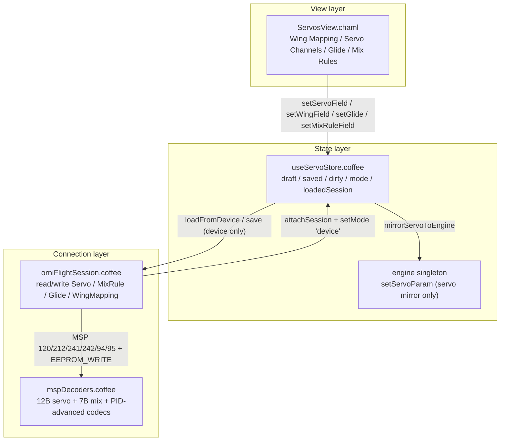

# OrniFlight Studio — Servos & Wing-Mapping

This document is the permanent record of the **Servos & Wing-Mapping** magnum
opus: the Horus-centred surface for the physical servo chain of an ornithopter.
It owns the polymorphic *draft → commit* lifecycle across three wire surfaces —
servo configurations, servo mix rules, and the wing-mapping appendix — mirrors
every modelled servo edit into the live simulation engine, and — only when a
controller is attached — synchronizes through the MSP session with per-record
writes and a read-back verification.

Companion documents:

- [`MSP-PROTOCOL.md`](MSP-PROTOCOL.md) — the byte-level MSPv2 layer beneath the
  session boundary described here.
- [`PID-TUNING-VIEW.md`](PID-TUNING-VIEW.md) and
  [`CONFIGURATION-VIEW.md`](CONFIGURATION-VIEW.md) — the sibling polymorphic
  stores; the draft/saved/mode pattern and the source-device pin are shared.

---

## 1. Architecture

The Servos view is **layered by responsibility**. A thin CHAML shell presents
*what* can be configured; a single stateful store owns *how* edits flow and
clamp; a session boundary owns *where* they persist. The wing-mapping appendix
rides the PID-advanced envelope as an opaque prefix + typed appendix + raw tail,
so foreign firmware fields round-trip byte-exactly.



### Four responsibilities, four files

| File | Role | Statefulness |
|---|---|---|
| `src/components/views/ServosView/ServosView.chaml` | Mode/dirty badges, action bar, Wing Mapping / Servo Channels / Glide / Mix Rules panels | Stateless (reads the store) |
| `src/components/views/ServosView/ServosView.sass` | `.layout-servos` grid, badges, action bar styling | Zero-state |
| `src/stores/useServoStore.coffee` | The single source of truth for the servo document | Zustand store |
| `src/protocol/mspDecoders.coffee` / `orniFlightSession.coffee` | Wire codec + session read/write boundary | MSP layer |

The view is mounted at the `/servos` route in `src/app/App.chaml`
(`servosEl = h(AnimatedPage, null, h(ServosView, null))`). Servo channels render
in `StudioAccordion` groups; wing-mapping and servo fields use the memoized
`ParamRow` slider primitive, so edits flow through stable `floatFromEvent` /
`intFromEvent` closures.

---

## 2. Wire format ground truth

The servo surface spans **three MSP surfaces** plus the PID-advanced appendix.
All layouts below were verified against the OrniFlight firmware
(`src/main/msp/msp.c`, API 1.47).

### MSP codes

| Code | MSP id | Direction | Purpose |
|---|---|---|---|
| `SERVO` | 103 | read | Live servo output channels (telemetry) |
| `SERVO_CONFIGURATIONS` | 120 | read | 8 × `servoParam_t` + ornithopter trailer |
| `SET_SERVO_CONFIGURATION` | 212 | write | Index-prefixed servo record *or* ≤4-byte glide payload |
| `SERVO_MIX_RULES` | 241 | read | 16 × `servoMixer_t` |
| `SET_SERVO_MIX_RULE` | 242 | write | Index-prefixed mix rule |
| `ORNITHOPTER_GLIDE_DEGREE` | 244 | write | **Stub** — firmware writes nothing; glide rides 212 |
| `PID_ADVANCED` / `SET_PID_ADVANCED` | 94 / 95 | read/write | Wing-mapping appendix (offsets 46+) |

### `servoParam_t` — 12 bytes per record

| Offset | Type | Field | Notes |
|---|---|---|---|
| 0 | u16 | `min` | PWM lower bound (LE) |
| 2 | u16 | `max` | PWM upper bound (LE) |
| 4 | u16 | `middle` | PWM midpoint (LE) |
| 6 | i8 | `rate` | signed |
| 7 | u8 | `forwardFromChannel` | |
| 8 | u32 | `reversedSources` | little-endian |

`SERVO_CONFIG_BYTES = 12`, `MAX_SERVO_CONFIGS = 8`. A write (212) prefixes the
record index (`u8`) → 13 bytes. The 120 trailer appends `glide` + the ONDAS v1
triplet (`cadence`, `ferocityD`, `balance`) as signed bytes with a `+128` wire
offset.

### `servoMixer_t` — 7 bytes per record

| Offset | Type | Field |
|---|---|---|
| 0 | u8 | `targetChannel` |
| 1 | u8 | `inputSource` |
| 2 | i8 | `rate` |
| 3 | u8 | `speed` |
| 4 | i8 | `min` |
| 5 | i8 | `max` |
| 6 | u8 | `box` |

`SERVO_MIX_RULE_BYTES = 7`, `MAX_SERVO_MIX_RULES = 16`. A write (242) prefixes
the rule index (`u8`) → 8 bytes.

### Wing-mapping appendix (PID_ADVANCED offsets 46–82)

The Betaflight PID-advanced prefix (46 bytes) is **opaque** — carried raw so
read-modify-write round-trips stay byte-exact. The OrniFlight appendix follows:

| Offsets | Fields | Wire type |
|---|---|---|
| 46 | `flap_base_frequency` | removed, always 0 |
| 47 | `flapBaseAmplitude` | s8 (+128) |
| 48 | `itermRelaxCutoff` | u8 |
| 49–51 | `cadence` / `ferocityD` / `balance` | s8 (+128) |
| 52–54 | `ferocityP` / `ferocityRoll` / `ferocityYaw` | u8 |
| 55–56 | `warpGain` / `warpYawGain` | s8 (+128) |
| 57–58 | `anchorGain` / `resonanceGain` | u8 |
| 59–62 | `servoMountAngle` ×4 | s8 (+128) |
| 63–66 | `flappingPhaseShift` ×4 | s8 (+128) |
| 67–70 | `prescience` / `espelho` / `saudade` / `ssff` | u8 |
| 71–72 | `servoTravelTimeMs` | u16 (LE) |
| 73–74 | `servoMaxAmplitude` / `flapMagnitude` | u8 |
| 75–78 | `wingOriginOffset` ×4 | s8 (+128) |
| 79–81 | `freqChannel` / `freqMin` / `freqMax` | u8 |
| 82 | `profileIndex` | u8 |
| 83+ | per-profile aeroelastic tail | carried raw |

`ORNITHOPTER_PAIR_COUNT = 4`. The WARP dual waveform is encoded as `warpGain`
and `warpYawGain`: left wing = base + warpRoll − warpYaw, right wing = base −
warpRoll + warpYaw.

---

## 3. The polymorphic store

`useServoStore` is a Zustand store implementing a **servo document** with three
copies of the same shape plus a mode flag and a **source pin**:

```coffee
draft:   { servos, glide, mixRules, wing }  # editable copy
saved:   { servos, glide, mixRules, wing }  # last committed copy
mode:    'sim' | 'device'                   # polymorphic switch
session: OrniFlightSession | null           # device transport
loadedSession: false                        # source pin — device read happened?
dirty:   false                              # draft diverges from saved
```

- **`mode: 'sim'`** — commits locally, mirrors servo fields into the engine,
  never touches MSP.
- **`mode: 'device'`** — `loadFromDevice()` reads all four surfaces; `save()`
  writes them with read-back; a `loadedSession` guard forces a read first.

### Clamp domains

| Domain | Range | Fields |
|---|---|---|
| `PWM_LIMITS` | 500–2500 | servo `min` / `max` / `middle` |
| `RATE_LIMITS` | −125–125 | servo `rate`, mix `rate` / `min` / `max` |
| `GLIDE_LIMITS` | −90–90 | `glide` |
| `SIGNED_LIMITS` | −128–127 | `SIGNED_WING_FIELDS`, pair arrays |
| `GAIN_LIMITS` | 0–100 | remaining wing gain fields |
| `CHANNEL_LIMITS` | 0–255 | `forwardFromChannel`, mix channel/speed/box |
| `PROFILE_INDEX_LIMITS` | 0–3 | `profileIndex` |

`finiteOr(fallback, value)` collapses `NaN` / `±Infinity` / `null` / `undefined`
to the lower bound while preserving finite `0`; `clampInt` rounds and clamps.

### Wing-field catalog

`setWingField` routes **only** fields in the closed `WING_FIELD_NAMES` catalog
(the union of `SIGNED_WING_FIELDS`, `FULL_U8_WING_FIELDS`, `WING_GAIN_FIELDS`,
plus `servoTravelTimeMs` and `profileIndex`). `setWingPairField` gates on
`PAIR_ARRAY_FIELDS` × `[0…ORNITHOPTER_PAIR_COUNT)`. Unknown or inherited object
keys (`'constructor'`, `'__proto__'`, `'toString'`) never pass, so no hostile
key can dirty the draft or reach the wire.

### Engine mirror

`setServoField` calls `mirrorServoToEngine`, which writes `min` / `max` /
`midpoint` / `rate` into the engine singleton via O(1) `setServoParam` calls.
The wire carries 8 `servoParam_t` slots; the engine mirrors only its 4 physical
servos — the remaining slots ride store-only.

---

## 4. Session boundary

All write paths share four invariants:

1. **Armed guard** — `throw` if `@lastStatus?.armed`.
2. **Index validation** — integer range check before encoding.
3. **EEPROM write** — `MSP_CODES.EEPROM_WRITE` after every mutation.
4. **Read-back verification** — re-read and compare before returning.

| Method | MSP | Read-back scope |
|---|---|---|
| `readServoConfigurations` / `writeServoConfiguration` | 120 / 212 + 250 | `min` / `max` / `middle` |
| `readServoTuning` / `readGlideDegree` / `writeGlideDegree` | 120 / 212 + 250 | full `glide` |
| `readServoMixRules` / `writeServoMixRule` | 241 / 242 + 250 | `targetChannel` / `inputSource` / `rate` |
| `readWingMapping` / `writeWingMapping` | 94 / 95 + 250 | `for own key of appendix` |

**Glide rides 212.** The firmware's `MSP_SET_ORNITHOPTER_GLIDE_DEGREE` (244)
stub writes nothing, so `writeGlideDegree` encodes a ≤4-byte payload through
`SET_SERVO_CONFIGURATION` — 1 byte for glide-only, 4 bytes for glide + ONDAS v1
triplet.

**Wing mapping is read-modify-write.** `writeWingMapping` reads the current
envelope, merges `{ envelope.appendix..., appendix... }`, re-encodes with the
raw prefix/tail, writes, then verifies each submitted key via
`wingMappingFieldMatches` (structural `JSON.stringify` equality — array fields
verify as whole documents, not references).

---

## 5. Security invariants (Validatio)

The Validatio audit (commit `2f9e14c`) hardened two defence-in-depth layers:

- **Closed catalog** — `setWingField` routes only `WING_FIELD_NAMES`; inherited
  keys never pass, so no false `dirty` and no prototype pollution.
- **Own-key read-back** — `writeWingMapping` iterates `for own key of appendix`;
  prototype-chain keys cannot fabricate a read-back failure, and own junk keys
  fail loudly against the typed-codec contract.
- **Whitelist encoders** — every encoder builds a fixed-size `Uint8Array` /
  `DataView` from whitelisted fields; attacker keys never reach the wire even
  without the store guard.
- **Graceful decoders** — all servo decoders are `remaining()`-guarded; a
  truncated payload degrades to a partial document, never a throw path.
- **XSS-free surface** — no `innerHTML` / `eval` / `Function` anywhere in the
  servo surface.

---

## 6. Performance profile

Micro-benchmarks from the Validatio pass (single-threaded, Node 22):

| Operation | Throughput |
|---|---|
| `decodeServoConfigurations` (100 B) | ≈ 280k ops/s |
| `decodeServoMixRules` (112 B) | ≈ 258k ops/s |
| `encodeServoConfiguration` (13 B) | ≈ 771k ops/s |
| `encodeServoMixRule` (8 B) | ≈ 839k ops/s |
| `encodePidAdvanced` (38 B appendix) | ≈ 86k ops/s |
| `setWingField` | ≈ 95k ops/s |
| `setServoField` (clone 8 + engine mirror) | ≈ 58k ops/s |

All paths run 4+ orders of magnitude above UI typing rate (~10/s). A device
save performs ≈78 MSP exchanges (~1–1.5 s @ 115200 baud) — accepted in favour
of correctness: read-back-per-write is a house invariant.

---

## 7. Testing

- `src/test/useServoStore.test.coffee` — store invariants: clamp domains,
  engine mirror, `loadedSession` guard, device load/save, unknown/inherited
  field rejection, non-finite degradation.
- `src/test/ServosView.test.coffee` — route render, mode/dirty badges, edit →
  dirty → revert/save flows.
- `src/test/mspDecoders.test.coffee` — codec round-trips for servo configs, mix
  rules, and the wing-mapping appendix.
- `src/test/orniFlightSession.test.coffee` — write/read-back failures, armed
  guard, index bounds, inherited-key guard.

Full suite: **430/430 green** across 34 files.

---

## 8. Troubleshooting

| Symptom | Cause | Resolution |
|---|---|---|
| `Firmware does not expose the wing-mapping appendix` | `readWingMapping` returned no `appendix` (older firmware) | Flash a firmware build with the wing-mapping fields |
| `Read the device before writing — the draft may belong to another craft` | `loadedSession` source pin unset | Call `loadFromDevice()` before `save()` in device mode |
| `Servo configuration read-back failed at index N` | Write landed, re-read mismatched (foreign device / stale) | Re-read the device and re-apply |
| `Glide read-back failed: expected X, received Y` | Glide write mismatch (firmware stub) | Confirm firmware carries glide via MSP 212 trailer |
| `Cannot write configuration while armed` | Controller is armed | Disarm before configuration writes |
| `No device session attached` | `save()` in device mode with no session | Attach a session first (`attachSession`) |
| `Wing-mapping read-back failed: N` | Own appendix key mismatch | Inspect the field domain; confirm the value is wire-representable |

---

## 9. Integration notes

- `byteReader.coffee` gained a `skip(count)` method (clamped, no-op on
  overshoot) to seek past the 8×12-byte servo records into the 120 trailer.
- `useConfigurationStore.coffee` retains a legacy `servos` slice (airframe
  model); the dedicated `useServoStore` is the canonical servo surface and the
  two share the same wire codec.
- The `ORNITHOPTER_GLIDE_DEGREE` (244) code is declared in `mspCodes.coffee`
  for completeness but intentionally unused — glide flows through 212.
