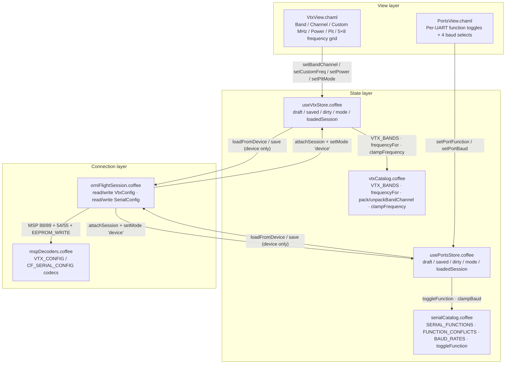

# OrniFlight Studio — VTX & Ports

This document is the permanent record of the **VTX & Ports** magnum opus:
the polymorphic configuration surface for the on-board 5.8 GHz video
transmitter and the UART serial-port assignment of an ornithopter. It owns the
*draft → commit* lifecycle across two wire documents — the VTX document
(`VTX_CONFIG` / `SET_VTX_CONFIG`) and the serial-port document
(`CF_SERIAL_CONFIG` / `SET_CF_SERIAL_CONFIG`) — merges the firmware box list
over a static catalog, and — only when a controller is attached — synchronizes
through the MSP session with read-back verification.

Companion documents:

- [`MSP-PROTOCOL.md`](MSP-PROTOCOL.md) — the byte-level MSPv2 layer beneath the
  session boundary described here.
- [`RECEIVER-MODES.md`](RECEIVER-MODES.md) and
  [`PID-TUNING-VIEW.md`](PID-TUNING-VIEW.md) — the sibling polymorphic stores;
  the draft/saved/mode pattern, the source-device pin, and the security
  invariants are shared.
- [`SERVOS-VIEW.md`](SERVOS-VIEW.md) — the servo & wing-mapping surface; shares
  the draft/saved/mode pattern and the armed-guard write discipline.

---

## 1. Architecture

The VTX & Ports surface is **layered by responsibility**. Two thin CHAML
shells present *what* can be configured; two stateful stores own *how* edits
flow and clamp; two pure catalogs own *what is legal* (bands, channels, powers,
baud rates, function masks); a session boundary owns *where* they persist. The
two surfaces are independent routes — `/vtx` and `/ports` — each with its own
store, but they share the same polymorphic discipline and the same connection
layer.

### Responsibilities, file by file

| File | Role | Statefulness |
|---|---|---|
| `src/components/views/VtxView/VtxView.chaml` | Mode/dirty badges, action bar, Band/Channel/Custom/Power controls, frequency grid | Stateless (reads the store) |
| `src/components/views/PortsView/PortsView.chaml` | Mode/dirty badges, action bar, per-port function + baud rows | Stateless (reads the store) |
| `src/stores/useVtxStore.coffee` | Single source of truth for the VTX document | Zustand store |
| `src/stores/usePortsStore.coffee` | Single source of truth for the serial-port document | Zustand store |
| `src/lib/vtxCatalog.coffee` | Static 5-band frequency table, wire-value pack/unpack, clamps | Pure module |
| `src/lib/serialCatalog.coffee` | Static function masks, conflict matrix, baud table, arbitration | Pure module |
| `src/protocol/mspDecoders.coffee` / `orniFlightSession.coffee` | Wire codec + session read/write boundary | MSP layer |

Both views are one-line `memo` wrappers (`VtxView.coffee`, `PortsView.coffee`)
around the CHAML, mounted as routes `/vtx` and `/ports` in `App.chaml` and
reached via the **VTX** and **Ports** tabs in `ConfigTabs.chaml`.

---

## 2. Wire format ground truth

The VTX document mirrors the OrniFlight `vtx.c` / `msp.c` layout exactly, so no
impedance exists between store and wire.

### VTX — MSP 88 (read) / 89 (write)

`VTX_CONFIG` streams **8 fixed bytes**:

| Offset | Field | Width | Notes |
|---|---|---|---|
| 0 | `vtxType` | u8 | `vtxDevType_e` (255 = unknown) |
| 1 | `band` | u8 | 1..5; 0 = CUSTOM |
| 2 | `channel` | u8 | 1..8 |
| 3 | `power` | u8 | 0..2 (Off / 25 mW / 200 mW) |
| 4 | `pitmode` | u8 | consumed only when a VTX device answers |
| 5 | `freq` | u16 LE | MHz, 5600..5950 window |
| 7 | `deviceIsReady` | u8 | 1 = firmware consumed pit/lowPowerDisarm |
| 8 | `lowPowerDisarm` | u8 | consumed only when a VTX device answers |

`SET_VTX_CONFIG` rides a **5-byte** payload: `[u16 value, u8 power, u8 pitmode,
u8 lowPowerDisarm]`. The u16 `value` is a *packed* channel selector: `≤ 63`
encodes `(band-1)×8 + (channel-1)` with 1-based band/channel; `64..5999`
encodes a custom frequency in MHz (band 0). The table is band-major and 1-based;
band 0 is the firmware's CUSTOM slot. The firmware only consumes `pitmode` and
`lowPowerDisarm` when a VTX device answered (`deviceIsReady == 1`).

### Serial ports — MSP 54 (read) / 55 (write)

`CF_SERIAL_CONFIG` streams **one 7-byte record per available port**:

| Offset | Field | Width | Notes |
|---|---|---|---|
| 0 | `identifier` | u8 | `serialPortIdentifier_e` (USART1..8 = 0..7, USB VCP = 20, SOFTSERIAL = 30/31) |
| 1 | `functionMask` | u16 LE | bitmask of `serialPortFunction_e` |
| 3 | `mspBaud` | u8 | baud-rate index into `baudRates[]` |
| 4 | `gpsBaud` | u8 | index |
| 5 | `telemetryBaud` | u8 | index |
| 6 | `blackboxBaud` | u8 | index |

`SET_CF_SERIAL_CONFIG` accepts any payload whose length is a multiple of 7 —
the whole port document travels in **one frame**, then `EEPROM_WRITE`.

The conflict matrix mirrors the firmware's `serialPinFunction` arbitration: a
port can never carry a conflicting pair. The curated UI set is six functions
(`MSP`, `RX`, `VTX_SA`, `VTX_TRAMP`, `GPS`, `BLACKBOX`); the full mask space
remains readable/writable on the wire and unknown bits are preserved.

---

## 3. The pure catalogs

Both catalogs are **zero-class, zero-side-effect** modules — nothing but frozen
constant tables and total functions.

### `vtxCatalog.coffee`

- **`VTX_BANDS`** — five frozen 8-entry tables (`BOSCAM A/B/E`, `FATSHARK`,
  `RACEBAND`) mirroring `vtx58frequencyTable`; `BAND_LETTERS = '-ABEFR'`.
- **`VTX_POWER_LEVELS`** — Off / 25 mW / 200 mW (`vtx_common.h` RTC6705 index).
- **`frequencyFor(band, channel)`** — exact table lookup; `null` outside range.
- **`packBandChannel(band, channel)`** — the inverse of the firmware's
  `newBand = value/8 + 1, newChannel = value%8 + 1`; `null` unless both are
  integers in range.
- **`unpackBandChannel(value)`** — the forward half; `null` outside `0..63`.
- **`lookupBandChannel(freq)`** — exact table match for a MHz value; `null`
  when custom.
- **`clampFrequency(freq)`** — rounds then clamps into `[5600, 5950]`.
- **`vtxValueFor(config)`** — the u16 wire value: a valid pair packs into
  `≤ 63`, anything else rides the frequency.

### `serialCatalog.coffee`

- **`SERIAL_FUNCTIONS`** — the curated six-function UI set, each `{ id, key,
  label }`.
- **`FUNCTION_CONFLICTS`** — the firmware arbitration matrix; `MSP` conflicts
  with `GPS`/`VTX_SA`/`VTX_TRAMP`, `RX` with `GPS`/`VTX_SA`/`VTX_TRAMP`, and so
  on.
- **`BAUD_RATES`** — the 16-entry `baudRates[]` table; the index *is* the wire
  value.
- **`BAUD_FIELDS`** — the four per-port baud fields in wire order.
- **`toggleFunction(mask, id, enabled)`** — the arbitration primitive: turning
  a function on clears every conflicting function on the same port; turning it
  off clears just the bit.
- **`SIM_PORT_DEFAULTS`** — UART1 + USB VCP, both `FUNCTION_MSP`, mirroring
  `pgResetFn_serialConfig` so dry-runs show a meaningful table.

---

## 4. The polymorphic stores

Both stores share the identical **draft/saved/mode** discipline inherited from
the sibling configuration surfaces:

| Field | Meaning |
|---|---|
| `draft` | The editable document (the wire format, cloned) |
| `saved` | The last committed document |
| `dirty` | `draft` diverged from `saved` |
| `mode` | `'sim'` (dry-run) or `'device'` (MSP) |
| `session` | The attached `orniFlightSession` (device mode only) |
| `loadedSession` | The session that produced `draft` — the source-device pin |
| `lastError` | The last read/save failure message (fail-loud) |

### `useVtxStore.coffee`

Edits are **pre-clamped and idempotent** — `setBand`, `setChannel`,
`setPower`, `setPitMode`, `setLowPowerDisarm` all bail on invalid input or on a
no-op. `setBandChannel` recomputes `freq` from the table; `setCustomFreq`
clamps into the legal window and forces `band: 0, channel: 0`. `save` commits
locally in sim mode and rides `session.writeVtxConfig` in device mode (with the
`loadedSession` guard). `loadFromDevice` pins `loadedSession` to the session that
produced the read, so values from a previous craft can never be written to a new
one.

### `usePortsStore.coffee`

`setPortFunction` runs **firmware arbitration** through `toggleFunction` — a
port carrying `MSP` that turns on `RX` will have `MSP` cleared automatically.
`setPortBaud` clamps the index into `BAUD_RATES` and ignores non-fields. Both
editors are no-op-safe. `normalizePorts` clamps `functionMask & 0xFFFF` and
every baud index, so a malformed wire document is never echoed back corrupted.
`loadFromDevice` falls back to `SIM_PORT_DEFAULTS` when the device answers with
an empty record set.

---

## 5. Session boundary

Four methods on `orniFlightSession.coffee` own the persistence:

| Method | Read/write | Wire |
|---|---|---|
| `readVtxConfig()` | `requestOptional VTX_CONFIG` → `decodeVtxConfig` | 88 |
| `writeVtxConfig(config)` | armed guard → `SET_VTX_CONFIG` → `EEPROM_WRITE` → read-back | 89 |
| `readSerialConfig()` | `requestOptional CF_SERIAL_CONFIG` → `decodeSerialConfig` | 54 |
| `writeSerialConfig(ports)` | armed guard → non-empty guard → single N×7 frame → `EEPROM_WRITE` → read-back | 55 |

**Read-back verification** is strict where the firmware is authoritative and
lenient where it is not:

- `vtxConfigMatches` verifies `band`/`channel`/`freq` and `power` strictly; it
  verifies `pitmode` and `lowPowerDisarm` **only when** `deviceIsReady == 1`
  (a VTX device answered and the firmware actually consumed them).
- `serialPortMatches` compares `functionMask` plus the four baud fields
  field-wise, per port — a missing or mismatched identifier fails loud with the
  port number in the message.

Every write method begins with the **armed guard** (`Cannot write configuration
while armed`), shared across all configuration surfaces.

---

## 6. Security invariants (Validatio)

- **No injection surface** — the VTX & Ports deliverables add no `eval`, no
  `new Function`, no `innerHTML`/`dangerouslySetInnerHTML`, no `child_process`.
- **All wire inputs are clamped** — `clampU8`/`clampU16` in the encoders,
  `functionMask & 0xFFFF` and `clampBaud` in the port normalizer,
  `clampFrequency` and `Number.isInteger` guards in `packBandChannel` + the
  store validators (no NaN/Infinity/fraction reaches the wire).
- **Truncation degrades, never throws** — `decodeVtxConfig` reads each field
  behind a `reader.remaining()` check; `decodeSerialConfig` stops at the last
  whole 7-byte record. A short frame yields a partial-but-valid document, never
  a crash.
- **Source-device pin** — `loadedSession` binds the document to the session that
  produced it; writing to a different device is refused loudly.
- **Fail-loud persistence** — empty/corrupt serial documents are rejected on
  save (`Serial port configuration missing`); read-back mismatches throw with a
  port identifier, never silently corrupt.
- **UX hardening** — the CUSTOM band option in the Band `<select>` is
  `disabled`; band 0 is only reachable through the frequency grid/input, so no
  accidental CUSTOM mode.

---

## 7. Performance profile

Validated with a temporary Vitest micro-benchmark probe (removed after the run):

| Path | Throughput |
|---|---|
| `pack/unpackBandChannel` | ~3.2 M ops/s |
| `clampFrequency` | ~5.8 M ops/s |
| `toggleFunction` + `clampBaud` | ~1.3 M ops/s |
| VTX codecs (encode + decode) | ~880 k ops/s |
| Serial codecs (encode + decode) | ~810–980 k ops/s |

500k codec ops + 400k catalog ops complete in **349.6 ms** — a factor 23 inside
the 8 s budget. All paths are **event-driven** (config read/write on user
action), never part of the 60 fps telemetry loop; store updates fire only on
user edits, so whole-store subscriptions cause no re-render thrash.

---

## 8. Testing

Seven test files plus the shared mock transport exercise the full surface:

| File | Coverage |
|---|---|
| `src/test/vtxCatalog.test.coffee` | Table lookups, pack/unpack roundtrips, clamps |
| `src/test/vtxPortsCodec.test.coffee` | `decode/encode` roundtrips for VTX (5-byte) and Serial (7-byte) records |
| `src/test/vtxPortsEdgeCases.test.coffee` | 22 boundary probes — half-open ranges, integer guards, truncation degradation |
| `src/test/useVtxStore.test.coffee` | draft/saved/dirty, no-op guards, sim vs device save, `loadedSession` pin |
| `src/test/usePortsStore.test.coffee` | `toggleFunction` arbitration, baud clamps, empty-read fallback |
| `src/test/VtxView.test.coffee` | Render, control wiring, dirty badge, read/save disable states |
| `src/test/PortsView.test.coffee` | Render, function toggle, baud select, arbitration note |
| `src/test/mockMspTransport.coffee` | Shared fake MSP transport for device-mode paths |

The full suite passes **573/573 (45 files)** under Node v22.17.1; `vite build`
is clean with bundle sizes identical to the v0.2 baseline.

---

## 9. Integration notes

- **Routes** — `/vtx` and `/ports` are mounted in `App.chaml` behind
  `AnimatedPage`; each is a `memo`-wrapped CHAML.
- **Tabs** — `ConfigTabs.chaml` adds the **VTX** and **Ports** `NavLink` tabs
  between OSD and Data.
- **Sim-first** — both stores boot in `sim` mode with firmware-mirroring
  defaults (`DEFAULT_VTX_CONFIG` / `SIM_PORT_DEFAULTS`), so the views render
  meaningfully before any device is attached.
- **Attach** — `attachSession(session)` flips the store to `'device'`; a
  `null` session returns it to `'sim'`. `Read device` is gated on
  `mode == 'device' && session`; `Save` is additionally gated on
  `loadedSession` (you must read before you write).

### Extending

To add a VTX band or function, edit the frozen catalog only — the store, codec,
and view all derive from it:

- **New band** — append a frozen `{ index, letter, name, frequencies }` entry to
  `VTX_BANDS` and extend `BAND_LETTERS`; nothing else changes.
- **New serial function** — add the mask constant, append it to
  `SERIAL_FUNCTIONS` with a label, and populate `FUNCTION_CONFLICTS`; the
  conflict matrix drives the rest.
